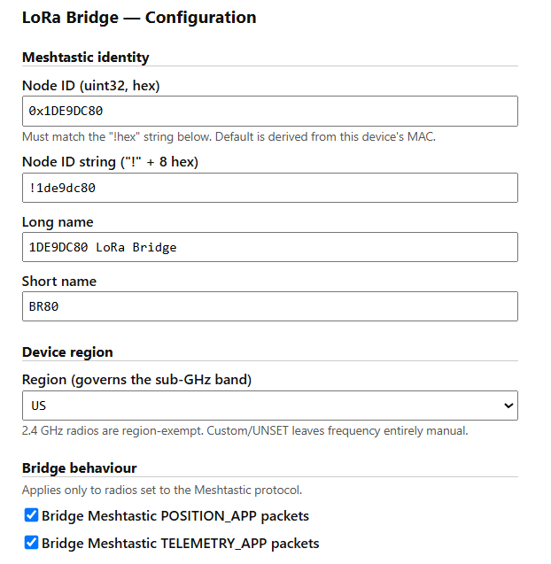
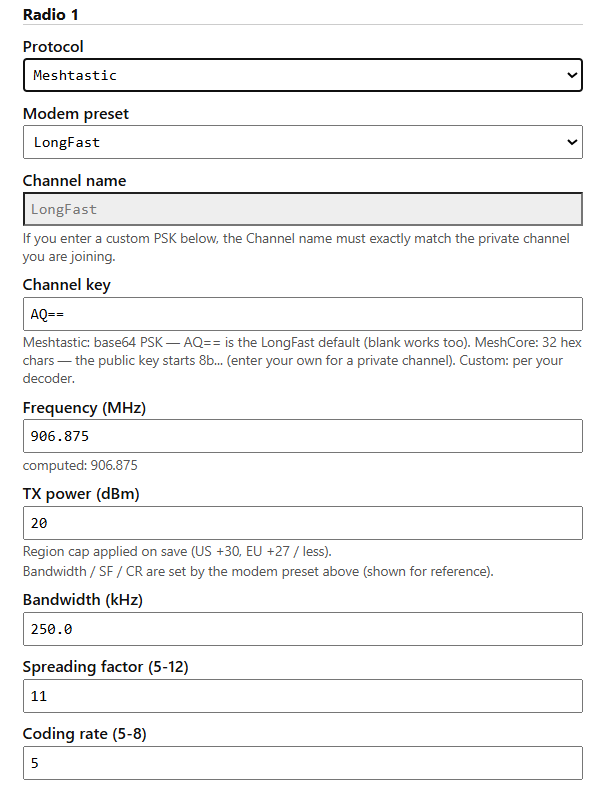
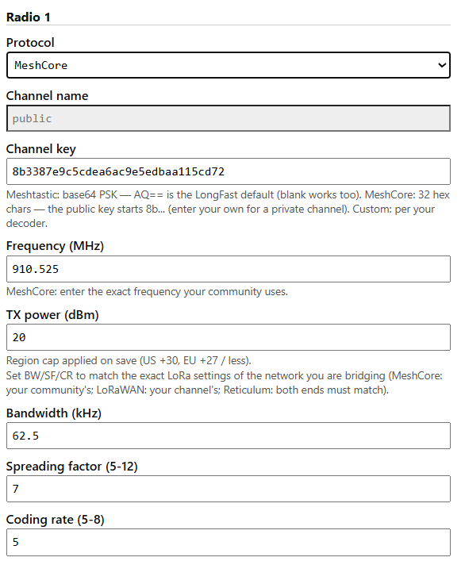
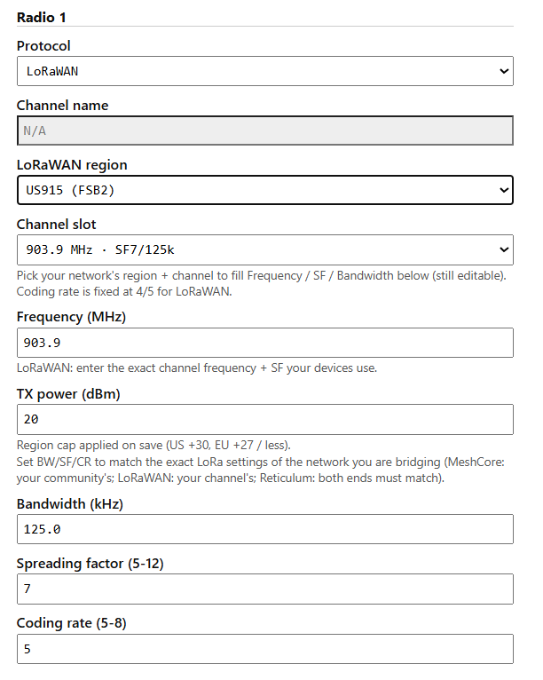
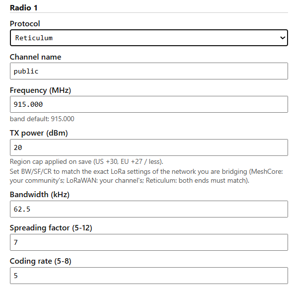
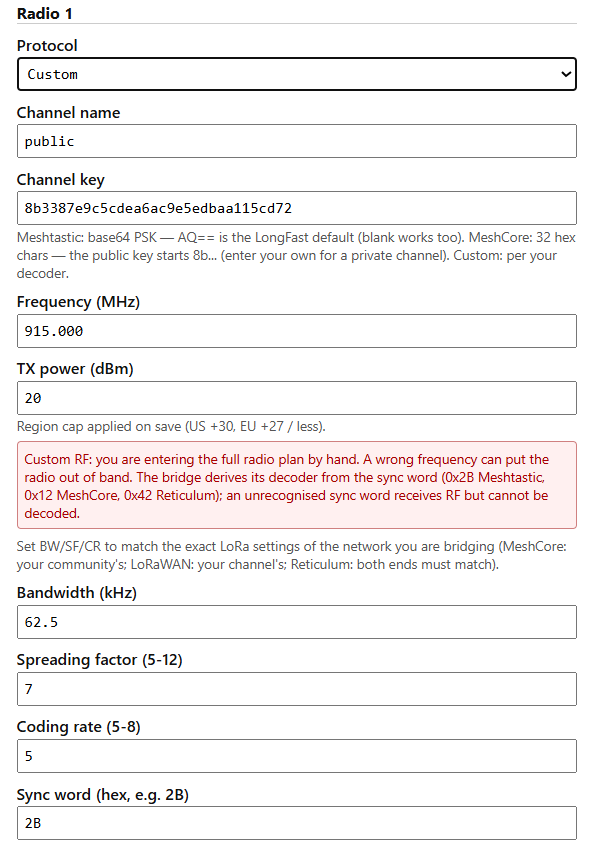
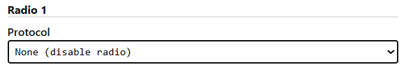
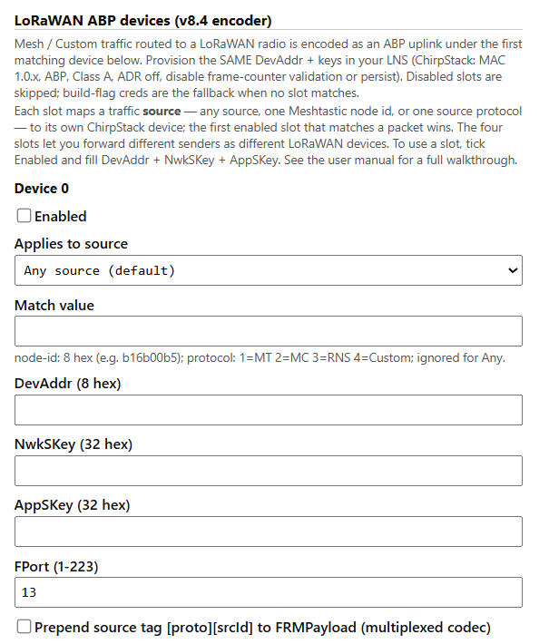
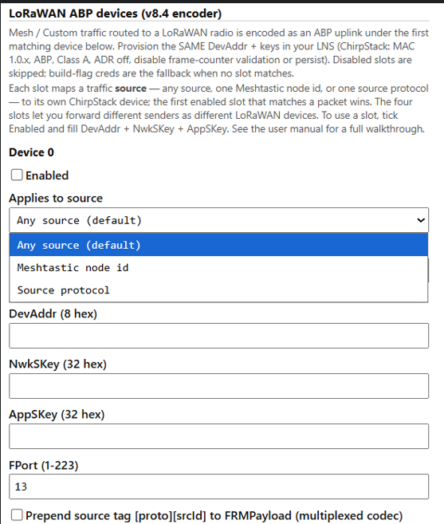

# LoRa Bridge — WiFi Config Portal & Compile-Time Settings

A field-by-field guide to the captive **WiFi configuration portal** and the
matching **`platformio.ini` build flags**. For flashing and hardware setup see the
[README](README.md#instructions); this manual covers *configuration only*.

Everything in the portal can also be **preloaded at compile time** so a fresh board
boots already configured — each field below names its build flag where one exists,
and [§8](#8-preloading-with-compile-time-build-flags) shows ready-made example builds.

---

## Contents
1. [Reaching the config portal](#1-reaching-the-config-portal)
2. [How to read this manual](#2-how-to-read-this-manual)
3. [Top frame — identity, region & bridge behaviour](#3-top-frame--identity-region--bridge-behaviour)
4. [Per-radio configuration](#4-per-radio-configuration)
   - [4.8 Radio 3 & Radio 4 (the second XIAO)](#48-radio-3--radio-4-the-second-xiao)
   - [4.9 Routing matrix — "Bridge received traffic to"](#49-routing-matrix--bridge-received-traffic-to)
5. [LoRaWAN ABP devices](#5-lorawan-abp-devices)
6. [Saving](#6-saving)
7. [Example setups](#7-example-setups)
8. [Preloading with compile-time build flags](#8-preloading-with-compile-time-build-flags)
9. [Other build flags (reference)](#9-other-build-flags-reference)

---

## 1. Reaching the config portal

- A **fresh or erased** board boots straight into the portal.
- On an **already-configured** board, reset it and — within the ~5 s window the
  serial log announces — press the **BOOT** button *or* send any character in the
  serial monitor. (The serial route matters when BOOT is hidden under a shield.)
  If neither works, erase the device (`pio run -t erase`) and it reboots into the portal.
- The bridge raises an open WiFi access point named **`LoRa-Bridge-XX`** (`XX` = the
  last byte of the node ID, unique per board). Join it from a phone or laptop; any
  web request is redirected to the single-page form at **`192.168.4.1`**.

The form is one long page: **identity → device region → bridge behaviour → Radio 1
→ Radio 2 → Radio 3 → Radio 4 → LoRaWAN ABP devices → Save**. Each radio also has a
**routing matrix** row. Hit **Save & reboot** to apply. (On a single Xiao, leave Radio 3
and Radio 4 set to `None`.)

---

## 2. How to read this manual

- **Fields are described once.** The per-radio fields (Protocol, Channel name,
  Channel key, Frequency, TX power, Bandwidth/SF/CR, Sync word) are the same for
  every radio, so they are defined once in [§4.1](#41-fields-common-to-every-radio);
  each protocol section only covers what is *special* about it.
- **Build flag:** where a field has a compile-time default, it is shown as
  `Build flag: FLAG_NAME`. All flags live in [`platformio.ini`](platformio.ini) and
  are optional — the portal overrides them at runtime. Fields with no flag are
  *portal-only* (stored in NVS, not settable at compile time).

---

## 3. Top frame — identity, region & bridge behaviour



### Meshtastic identity

| Field | What it is | Build flag |
|---|---|---|
| **Node ID (uint32, hex)** | The bridge's own Meshtastic node number. Must encode the same value as the string below. On a fresh board it is **derived from the device MAC** (unique per board). | *MAC-derived; portal-editable* |
| **Node ID string ("!" + 8 hex)** | The same number in Meshtastic's `!`-hex form. Validated to match the Node ID. | *MAC-derived; portal-editable* |
| **Long name** | The bridge's Meshtastic long name shown in clients. On a fresh board it defaults to **`<NodeID> LoRa Bridge`** (e.g. `1DE9DC80 LoRa Bridge`). | *auto from node ID; portal-editable* |
| **Short name** | The bridge's Meshtastic short name (max 8 chars). Defaults to **`BR` + the node ID's low byte** (e.g. `BR80`). | *auto from node ID; portal-editable* |

### Device region

| Field | What it is | Build flag |
|---|---|---|
| **Region (governs the sub-GHz band)** | Sets the sub-GHz band and the **TX-power cap applied on save** (e.g. US +30 / EU +27 dBm, further clamped to the SX1262's +22 dBm hardware max). **2.4 GHz radios are region-exempt**; `Custom`/`UNSET` leaves frequency entirely manual. This is a *device-wide* setting, **not** the LoRaWAN region (that is per-radio — see [§4.4](#44-lorawan)). | `BRIDGE_REGION` |

### Bridge behaviour

> *"Applies only to radios set to the Meshtastic protocol."*

| Field | What it is | Build flag |
|---|---|---|
| **Bridge Meshtastic POSITION_APP packets** | When on, decode + bridge Meshtastic position packets; off keeps them local to the MT mesh. | `BRIDGE_MT_POSITION` |
| **Bridge Meshtastic TELEMETRY_APP packets** | When on, decode + bridge Meshtastic telemetry packets. | `BRIDGE_MT_TELEMETRY` |

---

## 4. Per-radio configuration

A single Xiao has two radios: **Radio 1** (the B2B shield) and **Radio 2** (the edge
module). Adding a second Xiao as a **radio co-processor** over a UART crossover gives you
**Radio 3** and **Radio 4** as well (see [§4.8](#48-radio-3--radio-4-the-second-xiao)).
Each radio picks a **Protocol**, which shows/hides the fields below.

> **Classic 2-radio bridge:** leave **Radio 3** and **Radio 4** set to **`None`** (their
> default) and you have the original two-radio Meshtastic ↔ MeshCore bridge — no second
> Xiao, no UART link, no behaviour change. The Radio 3/4 fields and the routing matrix
> below simply do nothing, and existing saved configs upgrade unchanged.

### 4.1 Fields common to every radio

These appear (in this order) for most protocols; each protocol section notes which
it shows and any special behaviour.

| Field | What it is | Build flag (per radio `N` = 1–4) |
|---|---|---|
| **Protocol** | What the radio speaks: `Meshtastic`, `MeshCore`, `Reticulum`, `LoRaWAN`, `Custom`, or `None`. Picking it sets the LoRa **sync word** automatically (except Custom). | `LORA_RADIO N _SYNC_WORD` (0x2B MT · 0x12 MC · 0x42 RNS · 0x34 LoRaWAN) |
| **Channel name** | A display/label for the channel. For Meshtastic it is also part of the channel hash, so it matters on air (see §4.2). Locked or `N/A` for some protocols. | `LORA_RADIO N _CHANNEL_NAME` (or the global `BRIDGE_MT_CHANNEL_NAME` / `BRIDGE_MC_CHANNEL_NAME`) |
| **Channel key** | The channel secret: a **base64 PSK** for Meshtastic, **32 hex chars** for MeshCore, decoder-specific for Custom. The on-air channel-hash byte is derived automatically. | `LORA_RADIO N _CHANNEL_KEY` (or global `BRIDGE_MT_PSK_B64` / `BRIDGE_MC_KEY_HEX`) |
| **Frequency (MHz)** | The center frequency. | `LORA_RADIO N _FREQUENCY` |
| **TX power (dBm)** | Transmit power; the region cap (and the SX1262's +22 dBm max) is applied on save. | `LORA_RADIO N _TX_POWER` |
| **Bandwidth (kHz)** | LoRa bandwidth (7.8–500). | `LORA_RADIO N _BANDWIDTH` |
| **Spreading factor (5–12)** | LoRa SF. | `LORA_RADIO N _SPREAD_FACTOR` |
| **Coding rate (5–8)** | LoRa CR (the "5"–"8" denominator of 4/N). | `LORA_RADIO N _CODING_RATE` |
| **Sync word (hex)** | *Custom only* — the raw LoRa sync word. | `LORA_RADIO N _SYNC_WORD` |

> **Bandwidth/SF/CR must match the network you are bridging**, or nothing decodes
> (MeshCore: your community's; LoRaWAN: your channel's; Reticulum: both ends must match).

### 4.2 Meshtastic



- **Modem preset** *(Meshtastic only)* — picks a standard Meshtastic preset
  (LongFast, etc.). Choosing a preset **auto-fills Frequency and Bandwidth/SF/CR**
  to that preset's values. *No build flag of its own* — the preset is inferred from
  the radio's `LORA_RADIO N _BANDWIDTH/SPREAD_FACTOR/CODING_RATE`.
- **Channel name** is **locked to the preset name** (greyed) while the Channel key
  is the default. It auto-updates when you change the preset. The hint reminds you:
  *if you enter a custom PSK, the Channel name must exactly match the private channel
  you are joining.*
- **Channel key** defaults to **`AQ==`** (the LongFast public PSK; blank works too).
  **Entering a custom PSK unlocks the Channel name** so you can name your private channel.
- **Bandwidth / SF / CR** are shown **read-only** ("set by the modem preset above");
  to use a non-standard plan, use the **Custom** protocol instead.
- **Frequency** shows a `computed:` hint — the Meshtastic channel-slot frequency
  derived from region + preset; editable if you need to override it.

### 4.3 MeshCore



- **Channel name** is **locked to `public`** (greyed) while the Channel key is the
  default MeshCore public key. Entering a different key unlocks it for a private channel.
- **Channel key** is **32 hex characters**. The public key starts `8b…`; enter your
  own for a private channel.
- **Frequency** and **Bandwidth/SF/CR** are **fully editable** — MeshCore has no
  universal preset, so set them to exactly match your community's RF plan.

### 4.4 LoRaWAN



- **Channel name** is **`N/A`** (LoRaWAN has no named channel).
- **LoRaWAN region** *(LoRaWAN only)* — `US915 (FSB2)`, `AU915 (FSB2)`, `AS923`, or
  `EU868`. Aligns with ChirpStack regions. **Persisted** with the radio. *Portal-only*
  (no build flag).
- **Channel slot** *(LoRaWAN only)* — the default uplink channels for the chosen
  region. Picking a region + slot **auto-fills Frequency / SF / Bandwidth** below
  (all still editable). **Coding rate is fixed at 4/5** for LoRaWAN. *Portal-only.*
- **Frequency / Bandwidth / SF** are editable — set them to the exact channel + data
  rate your LoRaWAN network uses.

> This is the **keyless** LoRaWAN setting for the *radio*. To actually **transmit**
> LoRaWAN (encode mesh/Custom traffic as ABP uplinks) you also configure an identity
> in [§5, LoRaWAN ABP devices](#5-lorawan-abp-devices).

### 4.5 Reticulum



- **Channel name** is a free label (Reticulum has no channel key).
- Selecting Reticulum **auto-fills the RNode defaults** — **914.875 MHz / 125 kHz / SF8 /
  CR5**; **Frequency, Bandwidth, SF and CR** are all editable. **Both Reticulum endpoints
  must use the same plan** for the byte-for-byte repeat to work.

### 4.6 Custom



- You enter the **entire RF plan by hand**, including the **Sync word** — the bridge
  derives its decoder from the sync word (`0x2B` Meshtastic, `0x12` MeshCore, `0x42`
  Reticulum, `0x34` LoRaWAN). An unrecognised sync word still receives RF but cannot
  be decoded (a red warning explains this).
- All of Channel name, Channel key, Frequency, TX power, Bandwidth/SF/CR and Sync
  word are editable.

### 4.7 None



- **`None (disable radio)`** turns the radio off (single-radio / monitor mode). No
  other fields are shown. At least one radio must be active.

### 4.8 Radio 3 & Radio 4 (the second XIAO)

Radio 3 and Radio 4 are the two SX1262 radios on an **optional second Xiao** wired as a
**radio co-processor**. The main (host) Xiao runs the whole bridge — routing, dedup, this
portal, and the config for *all four* radios — and drives Radio 3 / Radio 4 over a **UART
crossover link** to the co-processor. The second Xiao has no portal of its own; you
configure R3/R4 here, on the host.

- **Same fields as Radio 1 / Radio 2.** Protocol, Channel name/key, Frequency, TX power,
  Bandwidth/SF/CR and Sync word behave exactly as in [§4.1](#41-fields-common-to-every-radio)
  and the per-protocol sections above — being remote changes nothing about how you fill them.
- **The "second XIAO" hint.** In the portal the Radio 3 / Radio 4 headings carry a reminder
  that they live on the second Xiao, reached over the UART crossover link.
- **Default = `None`.** Out of the box both R3/R4 are **`None (disable radio)`**, so a lone
  host Xiao never opens the UART link and behaves as the classic 2-radio bridge. Set a
  protocol on R3 and/or R4 only when the co-processor board is attached.
- **Wiring + flashing.** Both boards' UART1 — **D6 (TX) ↔ D7 (RX)**, wired **crossed**
  (host D6 → co-proc D7, host D7 → co-proc D6, GND ↔ GND) at **460800 baud**. Flash the
  co-processor firmware from [`coproc-xiao-sx1262/`](coproc-xiao-sx1262/) (env
  `xiao_coproc_sx1262` or `…_v1_1`). See the
  [README](README.md#four-radios--two-xiao-boards-optional) for the full wiring + flashing steps.

> **Reboot the host after resetting the co-processor.** The host pushes the R3/R4 config on
> link-up and re-sends it automatically when it sees the co-processor come back.

**Compile-time defaults** (per radio `N` = 3 or 4; mirror the R1/R2 flags in
[§8](#8-preloading-with-compile-time-build-flags)):

| Build flag | What it is |
|---|---|
| `LORA_RADIO N _ENABLE` | Promotes the slot off `None` at first boot (otherwise R3/R4 default to `None`). |
| `LORA_RADIO N _FREQUENCY` / `_BANDWIDTH` / `_SPREAD_FACTOR` / `_CODING_RATE` / `_TX_POWER` / `_SYNC_WORD` | Same RF fields as R1/R2 ([§4.1](#41-fields-common-to-every-radio)). |
| `LORA_RADIO N _CHANNEL_NAME` / `_CHANNEL_KEY` | Per-radio channel preload (same as R1/R2). |
| `LORA_RADIO N _ROUTE_MASK` | Pre-seed this radio's routing-matrix row (see [§4.9](#49-routing-matrix--bridge-received-traffic-to)). |
| `BRIDGE_LINK_TX_PIN` (43 = D6) / `BRIDGE_LINK_RX_PIN` (44 = D7) / `BRIDGE_LINK_BAUD` (460800) | The host↔co-processor UART crossover link; change only if you re-pin the cable. |

### 4.9 Routing matrix — "Bridge received traffic to"

Each radio has a **"Bridge received traffic to"** row: one checkbox per *other* radio.
Ticking a box means *traffic this radio receives is forwarded out that radio* (with
cross-protocol translation applied automatically per destination). This is the **per-radio
routing matrix** — you decide exactly which radios feed which.

- Each radio shows checkboxes for every radio **except itself** (a radio never bridges to
  itself). With four radios active you get up to three checkboxes per radio.
- **Cross-protocol translation is automatic** — if R1 is Meshtastic and you tick R2
  (MeshCore), MT → MC translation happens on that hop. Loops are dropped by the content-hash
  dedup, so it is safe to tick generously.
- **Default = the classic R1 ↔ R2 crossover.** On a fresh board R1 bridges to R2 and R2 to
  R1; R3/R4 bridge to nothing (they are `None`). So the default 2-radio bridge routes exactly
  as it always did.

| You want | Set the checkboxes |
|---|---|
| Classic 2-radio bridge (default) | R1 → R2, R2 → R1; R3/R4 = `None`. |
| Full 4-radio mesh | On each radio, tick all three other radios. |
| Two independent pairs | R1 ↔ R2 only, and R3 ↔ R4 only. |
| One-way feed (monitor R3 onto the R1 mesh) | Tick **R1** on Radio 3; don't tick R3 on Radio 1. |

> **Same-channel guard:** if a *routed* pair would put two Meshtastic (or two MeshCore)
> radios on the identical channel + frequency, Save rejects it — give them different
> frequencies or don't route between them.

---

## 5. LoRaWAN ABP devices



This section only appears in encoder-enabled builds (the standard build, as of v8.4).
It defines **how mesh / Custom traffic routed to a LoRaWAN radio is turned into a
valid LoRaWAN uplink**. Each uplink is sent under a bridge-held **ABP identity**;
provision the *same* DevAddr + keys in your LNS (ChirpStack: **MAC 1.0.x, ABP, Class
A, ADR off, frame-counter validation disabled or persisted**).

There are **four device slots** so you can forward different senders as different
ChirpStack devices. **The first *enabled* slot that matches a packet wins**; if none
match, the build-flag fallback credentials are used (`BRIDGE_LW_ENC_*`, below).

### Per-slot fields

| Field | What it is |
|---|---|
| **Enabled** | Turns this slot on. The minimum to use a slot is: tick **Enabled** and fill **DevAddr + NwkSKey + AppSKey**. |
| **Applies to source** | *Which incoming traffic this identity encodes* — see below. |
| **Match value** | The value the selector matches against (a node id or a protocol number); **ignored for "Any source."** |
| **DevAddr (8 hex)** | The ABP device address. Must match the device you create in ChirpStack. |
| **NwkSKey (32 hex)** | Network session key — computes the MIC. |
| **AppSKey (32 hex)** | Application session key — encrypts the payload (FRMPayload). |
| **FPort (1–223)** | The LoRaWAN port the uplink is sent on (default **13**). Useful to route different payload types in your codec. |
| **Prepend source tag** | Multiplexing option — see below. |

### "Applies to source" (the slot's matching rule)



This dropdown decides which packets a slot claims:

- **Any source (default)** — a catch-all. Any packet routed to the LoRaWAN radio that
  doesn't match a more specific slot is encoded with this identity. **Match value is
  ignored.** Use one "Any source" slot as your default device.
- **Meshtastic node id** — only packets from **one specific Meshtastic node**. Put that
  node's **8-hex node id** (e.g. `b16b00b5`) in **Match value**. Lets you give a single
  important MT node its own ChirpStack device/DevAddr.
- **Source protocol** — only packets from **one whole protocol**. Put the protocol
  number in **Match value**: **1 = Meshtastic, 2 = MeshCore, 3 = Reticulum, 4 = Custom.**
  Lets you, say, send all MeshCore traffic to one device and all Meshtastic to another.

**Resolution order:** an exact *Meshtastic node id* match is preferred, then a *Source
protocol* match, then the *Any source* default. So you can have a specific slot for one
node and a broad slot for everything else, and each packet lands on the most specific
enabled slot.

### "Prepend source tag [proto][srcId] to FRMPayload"

By default (off), **the source's identity is the DevAddr itself** — one bridge source =
one ChirpStack device. That is the simplest, cleanest setup.

Turn this **on** only when you want **one ChirpStack device (one DevAddr) to carry many
different bridge sources** (a "multiplexed" device). The bridge then prepends a **5-byte
tag** to every payload:

```
FRMPayload = [proto:1][srcId:4 bytes little-endian][ actual payload … ]
   proto  = 1 MT · 2 MC · 3 RNS · 4 Custom · 5 LoRaWAN
   srcId  = the source node id / hash
```

Your ChirpStack **JavaScript codec** ([`tools/chirpstack-codec.js`](tools/chirpstack-codec.js))
splits that tag back out into `data.source`. Enable the codec's tag handling by setting
the ChirpStack device **variable** `source_tag = true` for that device (so one pasted
codec serves both tagged and untagged devices). See
[`tools/chirpstack/README.md`](tools/chirpstack/README.md) and the importable
**device-profile templates** there.

### Build-flag fallback (single identity, no portal)

| Build flag | What it is |
|---|---|
| `BRIDGE_LW_ENCODE` | Compiles the ABP encoder in (**1** in the standard build). |
| `BRIDGE_LW_ENC_DEVADDR` | Fallback ABP DevAddr (default `0x01000001` — NwkID 0, matches ChirpStack's default NetID). |
| `BRIDGE_LW_ENC_NWKSKEY` / `BRIDGE_LW_ENC_APPSKEY` | Fallback 32-hex session keys (encoder stays idle until both parse). |
| `BRIDGE_LW_ENC_FPORT` | Fallback FPort (default 13). |
| `BRIDGE_LW_ENC_SELFTEST` | Run boot-time crypto known-answer self-tests → `[lw-selftest] … PASS`. |

These are used only when **no portal slot matches**, so a build with no portal devices
still emits under one identity.

### Enabling, provisioning & end-to-end flow

Emitting valid LoRaWAN is **keyed**. As of v8.4 the encoder **ships in the standard
`xiao_esp32s3` / `xiao_esp32s3_v1_1` build** — it stays **dormant** until you set a radio
to LoRaWAN *and* configure an ABP device above, so a stock MT/MC bridge is behaviourally
unchanged. No special env is needed (the `xiao_esp32s3_lwabp` env just adds the boot
self-test).

End to end:

1. Set a radio's protocol to **LoRaWAN** ([§4.4](#44-lorawan)) and configure an ABP device
   above (or the `BRIDGE_LW_ENC_*` build-flag fallback).
2. Provision the **same** DevAddr + NwkSKey + AppSKey in ChirpStack (**MAC 1.0.x, ABP,
   Class A, ADR off**), and paste [`tools/chirpstack-codec.js`](tools/chirpstack-codec.js)
   into the device profile's Codec tab — or import the ready-made templates in
   [`tools/chirpstack/`](tools/chirpstack/README.md).
3. The `0x34` radio then re-emits your decoded mesh (MT/MC) — or a **Custom** raw-LoRa
   station's raw bytes — as ABP uplinks for an in-range gateway to forward to ChirpStack.

**Status:** the encoder is **hardware-verified on air** (MT *and* MC → valid ABP uplinks,
decrypt + MIC checked — [`BENCH-RESULTS.md`](BENCH-RESULTS.md)); **live-ChirpStack ingestion
is the one remaining bench item** ([`BENCH-v8.4.md`](BENCH-v8.4.md)). Full design:
[`ABP-LORAWAN-SPEC.md`](ABP-LORAWAN-SPEC.md).

---

## 6. Saving


**Save & reboot** writes the config to NVS and restarts the bridge into normal
operation. Watch it come up over USB serial:

```bash
pio device monitor --port COMx
```

To change anything later, re-enter the portal ([§1](#1-reaching-the-config-portal)).

---

## 7. Example setups

Four common bridges. Set the radios as shown, then **Save & reboot**. Each can also be
**preloaded at compile time** — see [§8](#8-preloading-with-compile-time-build-flags).

### A. Meshtastic ↔ MeshCore  *(the shipped default)*

| | Radio 1 | Radio 2 |
|---|---|---|
| Protocol | Meshtastic | MeshCore |
| Modem preset / channel | LongFast | `public` |
| Channel key | `AQ==` | `8b3387…cd72` (public) |
| Frequency | 906.875 | 910.525 |
| BW / SF / CR | 250 / 11 / 5 (from preset) | 62.5 / 7 / 5 |

Bridges the Meshtastic LongFast mesh to the MeshCore public channel.

### B. Meshtastic → LoRaWAN (ABP uplink to ChirpStack)

| | Radio 1 | Radio 2 |
|---|---|---|
| Protocol | Meshtastic | LoRaWAN |
| LoRaWAN region / slot | — | US915 (FSB2) / 903.9 MHz · SF7/125k |
| Frequency | 906.875 | 903.9 |
| BW / SF / CR | 250 / 11 / 5 | 125 / 7 / 5 (CR fixed 4/5) |

Then add a **LoRaWAN ABP device** ([§5](#5-lorawan-abp-devices)) — Enabled, *Any
source*, your DevAddr + NwkSKey + AppSKey, FPort 13 — and provision the matching
device in ChirpStack. Meshtastic traffic is re-emitted as ABP uplinks a gateway
forwards to ChirpStack.

### C. Meshtastic public → Meshtastic private channel

| | Radio 1 | Radio 2 |
|---|---|---|
| Protocol | Meshtastic | Meshtastic |
| Channel name | `LongFast` (public) | *your private channel name* |
| Channel key | `AQ==` | *your private base64 PSK* |
| Frequency | 906.875 | **914.875** (must differ from R1) |
| BW / SF / CR | 250 / 11 / 5 | 250 / 11 / 5 |

Bridges a public Meshtastic channel to a private one. The two radios must be on
**different frequencies** (bridging the *same* channel + frequency to itself is
rejected). Enter the private channel's name + PSK on Radio 2 (entering a custom PSK
unlocks the Channel name field).

### D. Four-radio bridge (second XIAO)  *(v9.0)*

Attach a second Xiao as the radio co-processor ([§4.8](#48-radio-3--radio-4-the-second-xiao)),
then configure all four radios — for example R1 Meshtastic, R2 MeshCore, R3 Reticulum,
R4 LoRaWAN.

| | Radio 1 | Radio 2 | Radio 3 (2nd Xiao) | Radio 4 (2nd Xiao) |
|---|---|---|---|---|
| Protocol | Meshtastic | MeshCore | Reticulum | LoRaWAN |
| Bridge received traffic to | R2, R3, R4 | R1, R3, R4 | R1, R2 | R1, R2 |

Use the **routing matrix** ([§4.9](#49-routing-matrix--bridge-received-traffic-to)) to pick
which radios feed which — the table above is a full 4-way mesh; tick fewer boxes for
independent pairs or one-way feeds. **Leaving R3/R4 = `None` gives you example A again**
(the classic 2-radio bridge), no second Xiao required.

---

## 8. Preloading with compile-time build flags

If you build from source you can bake any of the above into the firmware so a fresh
board boots already configured (handy for flashing several identical bridges). Open
[`platformio.ini`](platformio.ini) and find the **"v8.4.1 — PER-RADIO CHANNEL
OVERRIDES + READY-MADE SCENARIO SETUPS"** block. It contains the three scenarios
above as commented `-D` blocks.

- **Scenario A** is the active default — nothing to do.
- For **Scenario B** or **C**: comment out the active *Radio 1/2 settings* block and
  uncomment the scenario block, then `pio run -e xiao_esp32s3` (or `…_v1_1`).
- For **Scenario D (4-radio)**: uncomment the **"v9.0 — READY-MADE 4-RADIO (DUAL-XIAO)
  SCENARIO"** block higher up in `platformio.ini` to enable + route R3/R4, then flash the
  second Xiao with the co-processor env (see [§4.8](#48-radio-3--radio-4-the-second-xiao)).
- **Per-radio channels:** `LORA_RADIO1_CHANNEL_NAME` / `LORA_RADIO1_CHANNEL_KEY` and
  the Radio 2 equivalents let each radio preload a *distinct* channel (needed for
  Scenario C, where both radios are Meshtastic on different channels).

> The build flags are **first-boot defaults only**. They apply when NVS is empty, so
> after changing them **erase the device** (`pio run -t erase -t upload`) to see the
> new defaults; otherwise the saved NVS config wins. You can always override any of
> them in the captive portal at runtime.

---

## 9. Other build flags (reference)

All optional, set in [`platformio.ini`](platformio.ini); the compiled-in default is
shown in parentheses. These are global tunables and behaviour toggles beyond the
per-field flags named in the sections above.

**Global radio**
- `LORA_PREAMBLE_LEN` (8) — LoRa preamble symbol count (all radios).
- `LORA_CRC` (1) — enable the LoRa hardware CRC.
- `LORA_TCXO_VOLTAGE` (1.8f) — TCXO control voltage.
- `LORA_MAX_PACKET` (256) — max LoRa packet buffer, bytes.

**Loop / duplicate guard**
- `BRIDGE_DEDUP_TTL_MS` (60000) — how long a seen *(body + sender id + packet_id)* hash blocks duplicates.
- `BRIDGE_DEDUP_TABLE_SIZE` (512) — recent-hash table entries.

**Outbound route queue (PSRAM-backed)**
- `BRIDGE_ROUTE_QUEUE_DEPTH` (64) — packets buffered per destination radio.
- `BRIDGE_ROUTE_MAX_AGE_MS` (30000) — drop a queued packet older than this.

**TX scheduler (CAD / CSMA / airtime throttle)**
- `BRIDGE_CAD_BACKOFF_MIN_MS` (20) / `BRIDGE_CAD_BACKOFF_MAX_MS` (120) — random CSMA backoff window after a busy CAD.
- `BRIDGE_TX_INFLIGHT_TIMEOUT_MS` (10000) — force-recover a non-blocking TX that never reports done.
- `BRIDGE_TX_DUTY_PERCENT` (50) — max self-TX duty cycle; `0` = no duty cap (min-gap only).
- `BRIDGE_TX_MIN_GAP_MS` (0) — absolute floor on the post-TX off-air gap.

**Source-identity preservation**
- `BRIDGE_IDENTITY_PRESERVE` (1) — `0` = clean-body / bridge-identity behaviour.
- `BRIDGE_TAG_ORIGIN_PROTO` (1) — `1` = `Alice@MT:` / `Alice @MC`; `0` = bare native-looking names.
- `BRIDGE_MC_NONAME_VIRTUAL` (0) — MeshCore body with no `name:` prefix: `0` = bridge id, `1` = per-channel virtual node.
- `BRIDGE_MC_NAME_MAX` (32) — longest MeshCore sender name parsed from a body prefix.
- `BRIDGE_VIRT_NODES_MAX` (32) — virtual-node LRU size.
- `BRIDGE_VIRT_NODEINFO_PERIOD_MS` (900000) — minimum interval between a virtual node's NodeInfo re-advertisements.

**Reticulum**
- `BRIDGE_RNS_MAX_FRAGS` (8) — max MT/MC fragments per tunneled RNS frame.
- `BRIDGE_RNS_INPROTO_REPEAT` (1) — transparent RNS↔RNS raw repeat when both radios are Reticulum; `0` = tunnel-only.

**LoRaWAN keyless tap** (separate from the keyed ABP encoder in [§5](#5-lorawan-abp-devices))
- `BRIDGE_LW_CAPTURE` (1) — log `evt=RX proto=LW` header metadata.
- `BRIDGE_LW_SUMMARY_TO_MESH` (1) — emit a one-line LoRaWAN metadata summary into the MT/MC mesh.
- `BRIDGE_LW_RELAY` (1) — transparent raw repeat between two LoRaWAN radios.

**Build-time validation** *(automatic — no flag to set)* — `src/LoraConfigCheck.h` rejects an
invalid `LORA_RADIO*` set at compile time (`#error` / `static_assert` on sync word, SF/CR/BW/region
sanity, and TX-power range).

**Bench only**
- `BRIDGE_BENCH_AUTOSAVE` — makes an erased board boot pre-configured and skip the captive portal.
  **Never enable this in a release build.**

---

*This manual covers firmware v9.0. For protocol/routing internals see
[README.md](README.md#routing--protocol-support-current-functionality); for the
LoRaWAN ABP encoder design see [ABP-LORAWAN-SPEC.md](ABP-LORAWAN-SPEC.md); for
ChirpStack integration see [tools/chirpstack/README.md](tools/chirpstack/README.md).*
