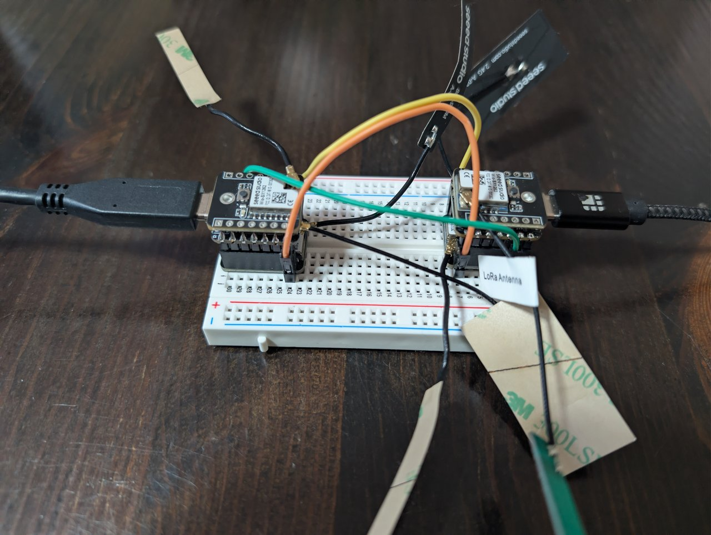

# Xiao-esp32s3-lora-repeater

Xiao ESP32S3 LoRa cross-band repeater — **two SX1262 radios on one Xiao**, or **four** by linking a second Xiao over a UART crossover.


*2-radio bridge — two SX1262 shields on one Xiao.*



*4-radio bridge — two Xiao linked by a UART crossover (optional).*

## Introduction / Background

A bidirectional LoRa mesh bridge running on a single Seeed Xiao ESP32S3 Sense with two Seeed Wio SX1262 shields stacked back-to-back — one mated to the Xiao's edge pins, the other to the 40-pin B2B header. The two radios share one SPI bus through a FreeRTOS mutex and each run in their own task pinned to a separate ESP32-S3 core, so they can transmit and receive in parallel on completely different RF profiles. **Optionally, two of these boards can be linked over a short UART crossover to expand the bridge to four radios** — one Xiao acts as the *master* (its captive portal owns the config for all four radios) and the second as a *radio co-processor* — for a four-radio omnidirectional repeater. A single Xiao still runs as the original two-radio bridge with no changes; see **Parts**, **Wiring**, and the [config user manual](CONFIG-USER-MANUAL.md) for the four-radio option. The same firmware also builds a **LoRa-commanded camera** — a XIAO ESP32S3 Sense (OV2640 + microSD) plus one edge SX1262, with an always-on WPA2 web portal, signed LoRa command-and-control, and photo/video capture to the SD; see **[LoRaCam](#loracam--lora-commanded-camera)**.

Each radio carries its own protocol **and** its own channel. The bridge relays packets received on one radio out the other — *cross-protocol* (e.g. Meshtastic↔MeshCore) or *same-protocol between two channels* (e.g. a private channel bridged to the public one). Each radio runs one of six protocols: **Meshtastic**, **MeshCore**, **Reticulum**, **LoRaWAN** (keyless tap + keyed ABP uplink encoder), **Custom** (any user-defined RF plan / sync word), or **None** (radio disabled). Everything — region, per-radio protocol, RF plan (frequency, bandwidth, spreading factor, coding rate, sync word, TX power), channels and identity — is configured through the WiFi captive portal; see the **[config user manual](CONFIG-USER-MANUAL.md)** for a field-by-field walkthrough and compile-time preloading. A single `.bin` flashed with no build flags first-boots straight into the portal, so no PlatformIO build is needed to deploy.

Supported today:

- **Meshtastic** (sync `0x2B`) — AES-CTR + a hand-written protobuf walker that lifts `TEXT_MESSAGE_APP` payloads out of the on-air `Data` submessage. `POSITION_APP` and `TELEMETRY_APP` are also decoded and bridged as compact text lines (`pos 40.7234,-74.0123 alt 12m`, `bat 87% 4.05V`, `env 22.5C RH 45% 1013hPa`). Defaults to the public LongFast channel; override `BRIDGE_MT_CHANNEL_NAME` / `BRIDGE_MT_PSK_B64` (or use the captive portal) to bridge a private channel — the PSK can be a short key, a 16-byte AES-128 key, or a 32-byte AES-256 key, and the channel hash is auto-derived. The bridge decodes incoming `NODEINFO_APP` packets into a 64-entry NVS-persistent NodeDB and emits its own periodic NodeInfo so phones surface the bridge as a known sender (`!b16b00b5`, "LoRa Bridge"). It also learns wall-clock time opportunistically from a `POSITION_APP` time field, so bridged MeshCore packets carry a real timestamp.
- **MeshCore channel** (sync `0x12`) — AES-128-ECB decrypt of `GRP_TXT`, with the 2-byte truncated HMAC-SHA256 verified against the channel key. Defaults to the MeshCore public channel (hash `0x11`); override `BRIDGE_MC_KEY_HEX` / `BRIDGE_MC_CHANNEL_NAME` in `platformio.ini` to bridge a private or custom channel instead — the on-air channel-hash byte is auto-derived from `SHA-256(key)[0]` at boot.
- **Reticulum / RNode** (sync `0x42`) — incoming frames are base64-encoded and bridged into the other mesh as text packets of the form `[rns <seq> <x>/<y>] <base64>`. The bridge auto-fragments across multiple MT/MC packets when a single one wouldn't hold the encoded frame, using a CRC-16 low-byte sequence ID so concurrent fragmented frames don't get mixed up on the receiving side. Fragments are paced by the per-radio **airtime throttle** (max 8 fragments per frame, tunable via `BRIDGE_RNS_*`). With both radios set to Reticulum, the bridge **transparently raw-repeats** RNS frames byte-for-byte — a range-extending RNS↔RNS repeater (`BRIDGE_RNS_INPROTO_REPEAT`, on by default). A proper `MT/MC → RNS` packet encoder is still TODO; until then that direction is a log-and-drop path on serial.
- **LoRaWAN** (sync `0x34`, **keyless**) — a localized capture/relay tap, *not* a gateway. The bridge reads only the **cleartext LoRaWAN MAC header** (MType, DevAddr, FCtrl, FCnt, FPort, FRMPayload length; JoinEUI/DevEUI on join-requests) — no keys, no payload decryption, no `FCnt`/MIC synthesis. It can log the header (`evt=RX proto=LW …`), emit a one-line metadata **summary** into your Meshtastic/MeshCore mesh (`BRIDGE_LW_SUMMARY_TO_MESH`), and **transparently raw-repeat** `0x34` frames between two LoRaWAN radios/bridges as a dedup-bounded flood (`BRIDGE_LW_RELAY`) — modeled on the [Tasmota LoRaWAN bridge](https://tasmota.github.io/docs/LoRa-and-LoRaWan-Bridge/). By default `MT/MC → LoRaWAN` is a deliberate log-and-drop (`no-lw-encoder`) — keyless firmware can't inject content. **New in v8.4:** an opt-in **keyed ABP uplink encoder** (`BRIDGE_LW_ENCODE` + ABP session keys) turns that path into a real LoRaWAN encode — it wraps decoded mesh (MT/MC) traffic into a valid LoRaWAN 1.0.x **ABP uplink** (DevAddr + `NwkSKey` + `AppSKey`, AES-CTR FRMPayload, AES-CMAC MIC, monotonic FCnt) and re-emits it over RF for an existing gateway to forward to a ChirpStack LNS. The encoder is **hardware-verified on air** (2026-06-16) — Meshtastic *and* MeshCore frames encode to valid ABP uplinks that decrypt back to the original text with a valid MIC; per-source ABP devices are **captive-portal–configured** with a reboot-safe FCnt, and a raw-LoRa / **Custom** source (the weather-station case) wraps its raw bytes into an uplink too. **The only remaining bench item is ingestion by a live ChirpStack LNS** (Tier C) — see [`BENCH-RESULTS.md`](BENCH-RESULTS.md). Single-channel per radio (no channel hopping, no Class-A RX windows).

### Routing & behavior

Every received packet is decoded once, run through a content-hash loop/dup guard, re-encoded for the *other* radio's protocol, and queued for a non-blocking transmit. The behavior worth calling out:

- **Clean far-side bodies.** The old `[MT !id name]` / `[MC]` / `[rns]` text markers are gone. Loop prevention is now a **TTL content-hash dedup** (FNV-1a over the decoded body + sender id + Meshtastic packet_id, recorded on receive *and* on every emission), which also drops the same packet heard on both radios and never false-drops a user message that happens to start with `[MT`. Folding the packet_id lets a node's genuinely-distinct messages with identical text through each time (new id → new hash) while echoes/replays (same id) still drop.
- **A repeat looks like it came from the original sender, not the bridge.** Cross-protocol **MC→MT** reconstructs the MeshCore sender as a *deterministic virtual Meshtastic node* (id = `FNV-1a("MC|"+name)`) and advertises a synthetic NodeInfo, so a phone shows the message from `Alice @MC`. Cross-protocol **MT→MC** prefixes the body with the Meshtastic sender's name (`Alice@MT: …`, NodeDB short-name or `!hexid`) — the only identity channel MeshCore group text offers. A **same-protocol, same-channel** pair on different frequencies is a *transparent raw repeat*: the original bytes go out unchanged (Meshtastic: hop_limit decremented, `relay_node` set), so the far side sees the original sender natively. The `@MT`/`@MC` origin tags are on by default (`BRIDGE_TAG_ORIGIN_PROTO=0` for bare native-looking names). The whole layer can be disabled with `-DBRIDGE_IDENTITY_PRESERVE=0` (clean-body / bridge-identity behaviour).
- **TX never clobbers RX.** Each radio defaults to receive; an outbound packet goes onto a per-destination, age-bounded, PSRAM-backed queue and is sent by a CAD-gated (listen-before-talk) non-blocking transmit with CSMA backoff and a duty-cycle airtime throttle. So a long SF11 transmit no longer makes the bridge deaf.
- **Structured serial logs.** The runtime log is now one greppable `ts=… evt=… radio=… key=val` line per pipeline event (`RX`/`DEDUP_PASS`/`DROP`/`QUEUE`/`CAD`/`TX_START`/`TX_DONE`/`THROTTLE`/`NODEDB`/`NODEINFO`/`CLOCK`), emitted atomically across both cores.
- **Real timestamps without an RTC (clock-learn).** The bridge has no RTC/NTP, so it *learns* wall-clock time — from inbound MeshCore packet timestamps (**v8.2.1**) and from Meshtastic `POSITION_APP` time (**v8.3**) — and stamps that real Unix time onto bridged MeshCore `GRP_TXT` (surfaced as `mcts=` and a one-time `evt=CLOCK`). Before this, `MT→MC` / `RNS→MC` hardcoded the timestamp to 0 and clients showed *1969*. A cold boot still stamps `0` only until the first timestamped packet calibrates it (inherent without an RTC).
- **Same-protocol transparent repeat spans every protocol.** Two radios on the *same* protocol + channel at *different* frequencies raw-repeat byte-for-byte — a range extender — for Meshtastic, MeshCore, **Reticulum (`RNS↔RNS`, v8.3)** and **LoRaWAN (`LW↔LW`, v8.3)**. The RNS / LoRaWAN repeats are byte-exact (no header mutation — a LoRaWAN MIC would break otherwise), loop-bounded by the shared content-hash dedup + the airtime throttle.
- **LoRaWAN: keyless tap, plus a keyed encoder (v8.4).** A `0x34` radio runs a keyless capture / metadata-summary / `LW↔LW` relay tap (**v8.3**). **v8.4** adds an opt-in **keyed ABP uplink encoder**: with ABP credentials set, `MT/MC → LoRaWAN` becomes a real ABP-uplink encode that RF-re-emits to a gateway → ChirpStack LNS (**hardware-verified on air** — MT *and* MC frames decrypt back, MIC valid; only the live-ChirpStack ingestion bench is open — [`BENCH-RESULTS.md`](BENCH-RESULTS.md)); with no keys it stays the keyless `no-lw-encoder` drop. The two modes are mutually exclusive per radio, selected by ABP config — and as of v8.4 the encoder ships in the standard V1.0/V1.1 build (dormant until configured), so a stock MT/MC bridge is **behaviourally** unaffected.
- **Per-radio routing matrix (4-radio).** With a second Xiao linked over the UART crossover you get four radios, and each one picks which of the others it bridges its received traffic to — a **"bridge received traffic to"** grid in the portal: `R1 → R2/R3/R4`, `R2 → R1/R3/R4`, `R3 → R1/R2/R4`, `R4 → R1/R2/R3`, each destination selectable independently. So you choose the topology — full four-way mesh, two independent pairs, or a one-way feed — rather than a fixed all-to-all. The default two-radio bridge is just `R1 ↔ R2` with R3/R4 disabled; cross-protocol translation and the loop/dup guard apply on every hop exactly as above.

**Everything above is tunable at compile time.** All flags are optional, each documented with its compiled-in default in [`platformio.ini`](platformio.ini); see the **[config user manual](CONFIG-USER-MANUAL.md)** for the full build-flag catalog.

All crypto runs on the ESP-IDF's built-in mbedTLS — no extra library dependencies beyond `jgromes/RadioLib` (pinned `7.7.0`).

**What's new in each release:** see [`CHANGELOG.md`](CHANGELOG.md) for the full per-version changelog. The latest is **v10.0 — LoRaCam**: the same firmware now builds a **LoRa-commanded camera** — a XIAO ESP32S3 Sense (OV2640 + microSD) plus one hand-wired edge SX1262, with encrypted / sender-whitelisted / replay-protected LoRa command-and-control, signed photo & video capture to microSD, and an always-on WPA2 web portal (live MJPEG, snap/record, SD browser, config, pairing) — plus an optional multi-hop C2 relay. All camera code is build-flag-gated (`-DBRIDGE_ROLE_CAMERA`), so the stock bridge binaries stay **byte-identical**; see **[LoRaCam](#loracam--lora-commanded-camera)**, [`LORACAM-SPEC.md`](LORACAM-SPEC.md) and [`BENCH-PHASE3.md`](BENCH-PHASE3.md). Prior release **v9.0 — the optional four-radio bridge**: link a second Xiao over a UART crossover for **four sub-GHz SX1262 radios** driven by a per-radio routing matrix, while a single Xiao stays **fully backwards-compatible** as the original two-radio bridge (R3/R4 default to disabled — see **[Wiring](#wiring)** and the [config user manual](CONFIG-USER-MANUAL.md)). It builds on the **v8.4 LoRaWAN ABP uplink encoder** ([v8.4 release](https://github.com/GrayHatGuy/Xiao-esp32s3-lora-repeater/releases/tag/v8.4-ABP-lorawan)) — **hardware-verified on air** (Meshtastic *and* MeshCore → valid ABP uplinks, decrypt-verified, MIC-valid; only live-ChirpStack ingestion remaining — [`BENCH-RESULTS.md`](BENCH-RESULTS.md)) — and the **[v8.3.1 release](https://github.com/GrayHatGuy/Xiao-esp32s3-lora-repeater/releases/tag/v8.3.1)** (Radio-2 V1.0/V1.1 fix). Design + bench docs: [`CONFIG-USER-MANUAL.md`](CONFIG-USER-MANUAL.md), [`BENCH-v9.0.md`](BENCH-v9.0.md) (four-radio bench), [`ABP-LORAWAN-SPEC.md`](ABP-LORAWAN-SPEC.md).

**Per-protocol summary** — the bridge dispatches by **LoRa sync word**; each radio is assigned a protocol in the portal, and a received packet is decoded once, run through the content-hash loop/dup guard, re-encoded for the *other* radio's protocol, and queued for a CAD-gated non-blocking transmit. Source identity is preserved/reconstructed across the bridge (see [`V8.2-SPEC.md`](V8.2-SPEC.md)).

| Protocol | Sync | RX (decode) | Bridge / TX | Identity across the bridge |
|----------|------|-------------|-------------|----------------------------|
| **Meshtastic (MT)** | `0x2B` | AES-CTR + protobuf walk: `TEXT_MESSAGE_APP`, `POSITION_APP`, `TELEMETRY_APP` → text line; `NODEINFO_APP` → NodeDB (not bridged) | Re-encodes for the destination. **Same channel, different frequency → transparent raw repeat** (original bytes, `hop_limit` decremented) | **MT→MC:** body prefixed `Name@MT:` (NodeDB short-name, else `!hexid`). **MT→MT raw repeat:** original sender preserved natively |
| **MeshCore (MC)** | `0x12` | AES-128-ECB `GRP_TXT` + 2-byte HMAC verify | Re-encodes `GRP_TXT` for the destination channel; same-channel/diff-freq → raw repeat | **MC→MT:** the `"Name: …"` sender becomes a deterministic virtual MT node `FNV-1a("MC|name")` with a synthetic NodeInfo (`Name @MC`); the name is moved into the MT header and stripped from the body |
| **Reticulum (RNS)** | `0x42` | **Not decrypted** — frame treated as opaque bytes (the bridge holds no RNS keys) | **RNS↔RNS:** transparent byte-for-byte raw repeat (range extender, `BRIDGE_RNS_INPROTO_REPEAT`). **RNS→MT/MC:** base64-tunneled as `[rns <seq> <x>/<y>] …` text fragments (CRC-16 seq id, 8-fragment cap, airtime-throttle-paced). **MT/MC→RNS: not implemented** (log-and-drop). See the [Reticulum roadmap](#reticulum--rnode-routing) | n/a — frames opaque; RNS→MT fragments carry the bridge's own MT id |
| **LoRaWAN (LW)** | `0x34` | **Keyless on RX** — cleartext MAC header only (MType / DevAddr / FCtrl / FCnt / FPort / len; JoinEUI/DevEUI on joins); no key, no received-payload decrypt (the **keyed** side is TX-encode only → see Bridge / TX) | **Capture** log + **metadata summary** to MT/MC (`BRIDGE_LW_SUMMARY_TO_MESH`); **LW↔LW transparent raw relay / dedup-bounded flood** (`BRIDGE_LW_RELAY`). **`MT/MC/Custom → LW`: keyed ABP uplink encoder (v8.4, opt-in)** — per-source ABP devices (portal-configured, reboot-safe FCnt) transcode to a valid LoRaWAN ABP uplink (CMAC MIC + AES-CTR FRMPayload + monotonic FCnt); a raw-LoRa **Custom** source sends its raw bytes (weather station). RF-re-emits for a gateway → ChirpStack (**hardware-verified on air**; only live-ChirpStack ingestion pending — [`BENCH-RESULTS.md`](BENCH-RESULTS.md)); default (no keys) stays the keyless `no-lw-encoder` drop | keyless tap: summaries carry the bridge's own MT/MC id. ABP encode: each uplink is sent under a bridge-held ABP device identity (DevAddr) |
| **Custom** | any (portal-entered) | user-chosen sync word; **no built-in decoder** | RF-agnostic dispatch by sync word; a Custom radio with no matching decoder receives + logs but has no protocol-specific re-encode | n/a |
| **None** | — | radio disabled (single-radio / monitor mode) | — | — |

Per-radio fields, the LoRaWAN ABP-device section and every build flag are documented in the **[config user manual](CONFIG-USER-MANUAL.md)**.

## Parts Required

| Part | Notes |
|------|-------|
| [Wio SX1262 with Xiao ESP32S3 (B2B 40-pin)](https://www.seeedstudio.com/Wio-SX1262-with-XIAO-ESP32S3-p-5982.html) | Radio 1 (B2B). Kit ships with the Xiao ESP32S3 Sense MCU |
| [Wio SX1262 for Xiao (edge-pin)](https://www.seeedstudio.com/Wio-SX1262-for-XIAO-p-6379.html) | Radio 2, sits on the Xiao's edge-pin header |
| 2 × LoRa antennas tuned for your ISM band | **Don't skip this.** Running an SX1262 at +20 dBm into a missing antenna kills your TX range and risks the PA |
| USB-C cable | Power, programming, serial monitor |

**Optional — four-radio bridge.** Add a **second** of everything above: another *Wio SX1262 with Xiao (B2B)* kit and a *Wio SX1262 for Xiao (edge)* for Radios 3/4, plus **two more antennas**. The two boards are joined with **3 jumper wires** (TX, RX, GND) for the UART crossover; power each board from its own USB-C, or jumper a shared 3V3 rail (see [Wiring](#wiring)). A small breadboard makes the crossover tidy.

*Some assembly required.*

## Wiring

This build uses **stacked shields** — there is no hand-wiring. The B2B SX1262
(Radio 1) mounts on the Xiao's 40-pin board-to-board connector; the edge-pin
SX1262 (Radio 2) mounts on the Xiao's perimeter header. The pin mapping is set in
the firmware (see `src/main.cpp`).

> ⚠️ **The Radio 2 edge module ships in two board revisions (V1.0 / V1.1) with
> different pinouts — you must build the firmware variant that matches yours.**
> Check the silkscreen first: see [Radio 2 module revision](#radio-2-module-revision-v10-vs-v11) below.

The table shows Radio 2 for **both module revisions** — build the env that matches your silkscreen ([how to identify yours](#radio-2-module-revision-v10-vs-v11)). **Bold** marks the four Radio-2 signals that move between V1.0 and V1.1 (NSS, DIO1, BUSY, ANT_SW); the shared SPI bus and RESET are identical on both.

| Signal | Radio 1 (B2B) | Radio 2 — **V1.0** (`xiao_esp32s3`) | Radio 2 — **V1.1** (`xiao_esp32s3_v1_1`) | Notes |
|--------|---------------|-------------------------------------|------------------------------------------|-------|
| SCK        | GPIO7 (D8)  | GPIO7 (D8)     | GPIO7 (D8)     | **shared** SPI bus |
| MOSI       | GPIO9 (D10) | GPIO9 (D10)    | GPIO9 (D10)    | **shared** |
| MISO       | GPIO8 (D9)  | GPIO8 (D9)     | GPIO8 (D9)     | **shared** |
| NSS / CS   | GPIO41      | **GPIO5 (D4)** | **GPIO4 (D3)** | per-radio chip select |
| DIO1 / IRQ | GPIO39      | **GPIO2 (D1)** | **GPIO1 (D0)** | RX-done interrupt |
| RESET      | GPIO42      | GPIO3 (D2)     | GPIO3 (D2)     | per-radio (same on both revs) |
| BUSY       | GPIO40      | **GPIO4 (D3)** | **GPIO2 (D1)** | per-radio |
| ANT_SW     | GPIO38      | **GPIO6 (D5)** | **GPIO5 (D4)** | TX/RX RF switch |
| VCC        | 3V3         | 3V3            | 3V3            | |
| GND        | GND         | GND            | GND            | |

**Optional — four-radio UART crossover.** For the four-radio bridge the two Xiao
boards are joined on their `Serial1` UART (`D6`/`D7`). Both boards run the same
firmware pin defaults, so **the cable does the crossover** — TX on one must reach
RX on the other:

| Master Xiao | → | Co-processor Xiao | Notes |
|-------------|---|-------------------|-------|
| **D6** / GPIO43 (TX) | → | **D7** / GPIO44 (RX) | crossed |
| **D7** / GPIO44 (RX) | ← | **D6** / GPIO43 (TX) | crossed |
| **GND** | — | **GND** | **required** — common ground |
| *3V3 or 5V* | — | *3V3 or 5V* | *only if powering both from one supply (see below)* |

- **Link speed** 460800 baud (override `BRIDGE_LINK_TX_PIN` / `_RX_PIN` / `_BAUD`).
- **Power:** simplest is a **separate USB-C to each board**. To run both from one
  supply, also jumper a **shared 3V3 (or 5V) rail** between them in addition to GND.
- Each board keeps its own two SX1262 shields + antennas — **four antennas total**.

> ⚠️ The data pair must be **crossed**: Master **D6 → co-proc D7** *and* Master
> **D7 → co-proc D6**. An un-crossed pair often looks half-working — one direction
> fine, the return line dead.

**Key points**

- The two radios **share one SPI bus** (SCK/MOSI/MISO); the firmware serializes
  access with a FreeRTOS mutex.
- Each radio has its own **NSS, DIO1, RESET, BUSY, ANT_SW**, so they run
  independently — one task per ESP32-S3 core.
- Radio 1's pins (GPIO38–42) are exposed **only on the 40-pin B2B connector**.
- The TCXO is internal to each Wio SX1262 module (1.8 V) — not wired to a GPIO.
- **Connect both u.FL antennas before power-on** — transmitting into a missing
  antenna risks the PA.
- **Four-radio option:** the second Xiao runs a small co-processor firmware and
  has **no portal of its own** — the master Xiao owns the config for all four
  radios and pushes Radio 3 / Radio 4's RF to the co-processor over the UART link
  at boot (and re-pushes automatically if the co-processor reboots). Leave Radio 3
  / Radio 4 **disabled** (the default) and the master never opens the link — it's a
  plain two-radio bridge.

### Radio 2 module revision (V1.0 vs V1.1)

**Seeed shipped the "Wio-SX1262 for XIAO" edge module with two different
pinouts.** The chip-select (NSS) moved between revisions, so flashing the wrong
variant means **Radio 2 won't be detected** (the bridge keeps running on Radio 1
alone and tells you which env to flash). Identify your module and build the
matching env.

Read the white silkscreen on the **Radio 2** module — both the version string and
the right-hand pin column:

| | **V1.0** | **V1.1** |
|---|---|---|
| Silkscreen | `Wio-SX1262 for XIAO V1.0` | `Wio-SX1262 for XIAO V1.1` |
| Right column (top→bottom) | D0, DIO1, RST, BUSY, **NSS**, RF_SW, D6 | DIO1, BUSY, RST, **NSS**, RF_SW, D5, D6 |
| **NSS** lands on | **D4 / GPIO5** | **D3 / GPIO4** |
| Build env | `xiao_esp32s3` (default) | `xiao_esp32s3_v1_1` |

| V1.0 | V1.1 |
|------|------|
|  |  |

```bash
# V1.0 module (default):
pio run -e xiao_esp32s3      -t upload --upload-port COMx
# V1.1 module:
pio run -e xiao_esp32s3_v1_1 -t upload --upload-port COMx
```

For the **optional four-radio bridge**, the second (co-processor) Xiao is its own
PlatformIO sub-project — build it with `-d coproc-xiao-sx1262`, picking the env that
matches *that board's* Radio-2 silkscreen:

```bash
# Co-processor — V1.0 edge module:
pio run -d coproc-xiao-sx1262 -e xiao_coproc_sx1262      -t upload --upload-port COMx
# Co-processor — V1.1 edge module:
pio run -d coproc-xiao-sx1262 -e xiao_coproc_sx1262_v1_1 -t upload --upload-port COMx
```

The firmware prints the revision it was built for at boot, so you can confirm from
the serial log:

```
[diag] R2 edge module = V1.0  (NSS=5 DIO1=2 RST=3 BUSY=4 RF_SW=6)
```

## LoRaCam — LoRa-commanded camera

**A camera that runs on this same firmware.** LoRaCam is a build variant (`-DBRIDGE_ROLE_CAMERA`) that turns a **XIAO ESP32S3 Sense** — the OV2640 camera, mic and microSD slot already on its rear B2B daughterboard — plus **one Wio SX1262 edge radio** into a LoRa-commanded, WiFi-viewable camera node. It reuses the bridge's radio stack, crypto, captive-config form and do-no-harm gating wholesale; every camera line is compiled only under the camera flag, so the stock bridge binaries stay **byte-identical** (`xiao_esp32s3` = 865781 B). Design of record: [`LORACAM-SPEC.md`](LORACAM-SPEC.md); bench evidence: [`BENCH-PHASE3.md`](BENCH-PHASE3.md), [`BENCH-CAMC2.md`](BENCH-CAMC2.md).

Three ways to use it:

- **Standalone** — the camera's own always-on **WPA2 web portal** does everything: live MJPEG video, snap / record / stop, browse the microSD, and the full radio/identity config form. No second device.
- **Paired** — a LoRa **commander** (any spare XIAO + Wio SX1262 on the same Custom `0x33` channel) sends *signed* commands over LoRa when the camera is out of WiFi range. Encrypted, sender-whitelisted, replay-protected.
- **Multi-hop** — a plain bridge relays those C2 frames commander → repeater → camera, so the camera needn't hear the commander directly (build flag `-DBRIDGE_CUSTOM_REPEAT`, off by default).

**Command-and-control** rides an encrypted binary frame on a **Custom sync-word `0x33`** radio: AES-CTR encrypt-then-MAC with an 8-byte AES-CMAC, a per-peer PSK, and a monotonic replay counter — a valid tag *is* the whitelist. Commands are snap photo, record video, stop, get status, plus operator text messaging. Media itself never travels over LoRa (airtime/duty forbid it) — LoRa carries only the command, the result, and the filename; the portal serves the actual JPEG/AVI. A signed `snap` writes a real 800×600 JPEG to `/loracam/IMG_%05u.jpg` and returns the filename in the ACK; `record` writes an MJPEG-AVI to `/loracam/VID_%05u.avi` (~5 fps, plays in VLC). The microSD shares the radio's SPI bus (CS = GPIO21), serialized by the same mutex.

### Parts — LoRaCam

| Part | Notes |
|------|-------|
| [Seeed XIAO ESP32S3 **Sense**](https://www.seeedstudio.com/XIAO-ESP32S3-Sense-p-5639.html) | The Sense daughterboard carries the OV2640 camera, mic **and** microSD — snaps onto the rear 40-pin B2B connector, no wiring |
| [Wio SX1262 for Xiao (edge-pin)](https://www.seeedstudio.com/Wio-SX1262-for-XIAO-p-6379.html) | The single LoRa radio (R2). **Hand-wired with flying leads**, not stacked — see below |
| LoRa antenna (u.FL) tuned for your ISM band | **Fit it before power-on** — the node beacons on boot; TX into a missing antenna risks the PA |
| microSD card | Photo/video storage; formatted FAT32 |
| USB-C cable | Power, programming, serial monitor |

> The B2B (Radio 1) slot is **occupied by the camera/mic bus** (GPIO38–42), so a camera build runs **Radio 1 disabled** and uses only the edge radio. The camera daughterboard and the edge radio's baseboard both want the XIAO's underside, so the edge radio can't stack — it is **hand-wired with 9 flying leads** to the XIAO's edge pins.

### Wiring — LoRaCam (9 flying leads)

Wire the **Wio SX1262 edge module** to the XIAO's edge pins. This is the **same R2 pin map** as the bridge's edge radio ([Wiring](#wiring) above) — flying leads instead of a stacked header. The map below is **V1.0**; for a **V1.1** module use the V1.1 Radio-2 column from the [Wiring table](#wiring) and build with `-DWIO_SX1262_REV=11`. Leave **RF_SW open** (unconnected). The camera, mic and microSD need **no wires** — they're on the rear daughterboard.

| Wio SX1262 edge pad | → | XIAO pin (V1.0) | Notes |
|---------------------|---|-----------------|-------|
| 3V3  | → | 3V3         | |
| GND  | → | GND         | |
| SCK  | → | D8 (GPIO7)  | shared SPI bus (also the microSD's) |
| MISO | → | D9 (GPIO8)  | shared |
| MOSI | → | D10 (GPIO9) | shared |
| NSS  | → | D4 (GPIO5)  | radio chip select |
| BUSY | → | D3 (GPIO4)  | |
| RST  | → | D2 (GPIO3)  | |
| DIO1 | → | D1 (GPIO2)  | RX-done interrupt |
| RF_SW | | *(leave open)* | not connected |

> ⚠️ **Fit the u.FL antenna before first power-on** — the node TXes a beacon autonomously on boot. A camera-init inrush + TX ramp + SD write can brown-out the 3V3 rail; add bulk capacitance on 3V3 if you see resets.

### Build & flash — LoRaCam

The camera is its own PlatformIO env, `xiao_loracam`. A fresh board **first-boots straight into the WPA2 portal** (no open AP). For a **V1.1** edge module add `-DWIO_SX1262_REV=11`.

```bash
# V1.0 edge module (default):
pio run -e xiao_loracam -t upload --upload-port COMx
# then open the serial monitor to see the AP come up:
pio device monitor --port COMx
```

> ⚠️ `pio run -t erase` wipes the **whole** flash (app included) — always follow it with `-t upload`.

### Using it — the web portal

1. **Join the camera's WiFi.** SSID `LoRaCam-XX` (`XX` = low byte of the MAC-derived node id), WPA2 passphrase `loracam-portal` (change it on the Security tab).
2. **Open** `http://192.168.4.1` and **log in** — default `admin` / `loracam-admin`.
3. **Home** — live MJPEG video, with **snap / record / stop / status** buttons and operator messaging.
4. **Photos** — browse, view, download or delete the photos and videos on the microSD.
5. **Config** — the full radio / identity form (the same one the bridge captive portal serves); **Pairing** — manage the trusted-commander whitelist; **Security** — change the WiFi passphrase and the portal login.

The full field-by-field walkthrough — every portal screen, its build flag, and example setups — is in the [config user manual](CONFIG-USER-MANUAL.md).

### Pairing a LoRa commander

To command the camera over LoRa (out of WiFi range), pair a **commander** — any spare XIAO + Wio SX1262 on the same Custom `0x33` channel. On the camera's **Pairing** page, add the commander's 8-hex C2 id and the shared 32-hex PSK, and mark it **Primary**. On the commander, whitelist the camera with the **same** key. Thereafter the commander mints signed commands and the camera ACKs unicast to whoever sent them; beacons broadcast to any in-range whitelisted commander. For a bench pair, the `bench_camc2` (camera) and `bench_camc2_cmdr` (commander) envs come pre-provisioned — in the commander's serial monitor, type `s` = snap, `r` = record 30 s, `x` = stop, `g` = get-status, `m` = message. Bench record: [`BENCH-CAMC2.md`](BENCH-CAMC2.md).

### Multi-hop

A plain bridge can relay C2 frames **commander → repeater → camera**, so the camera never has to hear the commander directly. Build the relay with `-DBRIDGE_CUSTOM_REPEAT` (a flag-gated Custom same-channel raw-repeat, **off by default** so stock builds stay byte-identical) — set both of its radios to Custom `0x33` on the same channel, on different frequencies, and route `R1 ↔ R2`. Proven on a 3-board frequency-split rig (the camera on `906.875` cannot hear the commander on `905`; with the repeater down, the camera stays silent — a clean negative control). See [`BENCH-PHASE3.md`](BENCH-PHASE3.md) and the [config user manual](CONFIG-USER-MANUAL.md).

## Instructions

> **Fastest path (no toolchain).** **First check your Radio 2 module's silkscreen revision** ([Radio 2 module revision](#radio-2-module-revision-v10-vs-v11) above) and download the **matching** `vanilla-factory` bin from the [latest release](https://github.com/GrayHatGuy/Xiao-esp32s3-lora-repeater/releases/latest): `…-v1.0-vanilla-factory.bin` for a **V1.0** Radio-2 module, `…-v1.1-vanilla-factory.bin` for **V1.1**. Connect both antennas and flash it to offset `0x0` — e.g. `esptool.py --chip esp32s3 write_flash 0x0 <bin>`, or drag it into the [ESP web flasher](https://espressif.github.io/esptool-js/) at address `0x0`. A fresh/erased device first-boots straight into the captive portal, so you can **skip to step 4** (bridge setup). The numbered steps below are for building from source.

1. **Stack the hardware.** Mate the B2B shield (radio 1) on top the Xiao, the edge-pin shield (radio 2) on bottom. Connect antennas to **both** radios before powering on. Correct orientation has all antennas on the same side.
2. **Install [PlatformIO](https://platformio.org/install)** — the VS Code extension is the easiest path.
3. **Build, flash & monitor.** Read the **Radio 2** silkscreen and pick the matching env (see [Radio 2 module revision](#radio-2-module-revision-v10-vs-v11) above): **V1.0** → `xiao_esp32s3` (default), **V1.1** → `xiao_esp32s3_v1_1`. Then erase, clean-build, flash and open the serial monitor (replace `COMx` with your port):
   ```bash
   # --- MASTER Xiao — V1.0 Radio-2 module (default) ---
   pio run -e xiao_esp32s3 -t erase --upload-port COMx     # wipe flash + NVS (boots into the portal)
   pio run -e xiao_esp32s3 -t clean
   pio run -e xiao_esp32s3
   pio run -e xiao_esp32s3 -t upload --upload-port COMx
   pio device monitor --port COMx

   # --- MASTER Xiao — V1.1 Radio-2 module ---
   pio run -e xiao_esp32s3_v1_1 -t erase --upload-port COMx
   pio run -e xiao_esp32s3_v1_1 -t clean
   pio run -e xiao_esp32s3_v1_1
   pio run -e xiao_esp32s3_v1_1 -t upload --upload-port COMx
   pio device monitor --port COMx
   ```
   The clean matters whenever a header changes. Building the wrong variant won't harm anything — Radio 1 still comes up and the boot log names the env to flash — but Radio 2 won't be detected with the default env if your board is **V1.1**, until you flash the matching variant. The boot log echoes the active map:
   ```
   default (V1.0): [diag] R2 edge module = V1.0 (NSS=5 DIO1=2 RST=3 BUSY=4 RF_SW=6)
   V1.1:           [diag] R2 edge module = V1.1 (NSS=4 DIO1=1 RST=3 BUSY=2 RF_SW=5)
   ```
   **Four-radio bridge — also flash the co-processor.** The second Xiao is a
   separate sub-project; build it with `-d coproc-xiao-sx1262` and the env matching
   *its own* Radio-2 silkscreen, on its own COM port:
   ```bash
   # Co-processor — V1.0 edge module (use xiao_coproc_sx1262_v1_1 for a V1.1 module)
   pio run -d coproc-xiao-sx1262 -e xiao_coproc_sx1262 -t erase  --upload-port COM_COPROC
   pio run -d coproc-xiao-sx1262 -e xiao_coproc_sx1262 -t upload --upload-port COM_COPROC
   ```
   The co-processor has no portal and is **silent on its own USB** — it relays its
   status to the master's serial log. With the UART crossover wired, the master
   prints `[coproc] R3 cfg ok …` / `R4 cfg ok …` once the link comes up.
4. **Bridge setup.** A fresh or erased board first-boots into an open WiFi access point named `LoRa-Bridge-XX`; join it from a phone or laptop and any web request redirects to the config form at `192.168.4.1`. There you set device region, per-radio protocol / RF / channel, identity, and the LoRaWAN ABP devices. To re-enter the portal on a configured board, reset it and press **BOOT** or send any serial character within ~5 s (or erase it). **For the full field-by-field walkthrough — every field, its build flag, the LoRaWAN ABP details, and ready-made example setups — see the [config user manual](CONFIG-USER-MANUAL.md).**
5. **Serial Debug Monitor.** Watch the bridge over USB serial. On a four-radio
   bridge, **monitor the master Xiao** — the co-processor relays its logs to the
   master (as `[coproc] …`), so its own USB port stays quiet:
   ```bash
   pio device monitor --port COMx
   ```
   Expect RX summary lines (size / RSSI / SNR), protocol-decoded summaries, bridge re-encode lines, NodeInfo broadcasts, and `loop-drop` messages when relay echoes come back to the bridge.

## Roadmap

### Other future work

- [x] ~~**v10.0: LoRaCam — a LoRa-commanded camera.**~~ — **done**; specced in [`LORACAM-SPEC.md`](LORACAM-SPEC.md). A XIAO ESP32S3 Sense (OV2640 + microSD) + one hand-wired edge SX1262 becomes a camera node: encrypted / sender-whitelisted / replay-protected C2 over Custom `0x33` (AES-CTR encrypt-then-MAC, 8-byte CMAC, per-peer PSK, monotonic replay counter), signed photo (`/loracam/IMG_*.jpg`) & video (`/loracam/VID_*.avi`) capture to microSD, an always-on **WPA2 web portal** (live MJPEG + snap/record/stop + SD browser + the config form + pairing + messaging), secure first-flash, and optional multi-hop C2 relay (`-DBRIDGE_CUSTOM_REPEAT`). All build-flag-gated (`-DBRIDGE_ROLE_CAMERA`) → stock bridge binaries **byte-identical**. Bench-proven on silicon ([`BENCH-PHASE3.md`](BENCH-PHASE3.md), [`BENCH-CAMC2.md`](BENCH-CAMC2.md)). See **[LoRaCam](#loracam--lora-commanded-camera)**.

- [x] ~~More Meshtastic portnums bridged: `POSITION_APP` and `TELEMETRY_APP`~~ — **done**; both decoded and re-emitted as text under the existing bridge marker. Individually gated by `BRIDGE_MT_POSITION` / `BRIDGE_MT_TELEMETRY` build flags. `NODEINFO_APP` is decoded into the NodeDB and intentionally not bridged as text.
- [x] ~~MeshCore private-channel support~~ — **done** via `MeshCoreConfig.{h,cpp}`; override `BRIDGE_MC_KEY_HEX` and `BRIDGE_MC_CHANNEL_NAME` in `platformio.ini` to point the bridge at any MC channel. The hash byte is computed automatically from `SHA-256(key)[0]`.
- [x] ~~Persistent NodeDB so `[MT] …` prefixes can be replaced with the actual sender's short name~~ — **done** in `NodeDB.{h,cpp}`; MT→MC bridged messages now carry `[MT !<hexid> <SHORT>] …` attribution learned from `NODEINFO_APP` packets and persisted to NVS.
- [x] ~~**WiFi captive-portal first-boot config.**~~ — **done** via `BridgeConfig.{h,cpp}` + `CaptivePortal.{h,cpp}`. On a fresh flash (or whenever the BOOT button is pressed within ~3 s of reset) the bridge brings up an open AP named `LoRa-Bridge-<XX>` and DNS-redirects all HTTP traffic to a config form for MT identity, MC key + channel name, and the POSITION/TELEMETRY toggles. Saving the form writes the schema-v1 blob to NVS and reboots into bridge mode. Per-radio LoRa params (frequency, BW, SF, CR, TX power, sync word) remain build-flag-only — a misstep there can put the radio out of band.
- [x] ~~**F5: Meshtastic private-channel support.**~~ — **done** via `MeshtasticConfig.{h,cpp}` (the symmetric counterpart to F3). A base64 PSK + channel name from `BridgeConfig` are expanded — empty→LongFast, 1-byte short key, 16-byte AES-128, 32-byte AES-256 — and the on-air channel hash is derived as `XOR-fold(name) ^ XOR-fold(key)`. The five MT decoders + two MT encoders take key length from `MeshtasticConfig::keyLen` so AES-256 channels work. `BridgeConfig` schema bumped to v2 (auto-migrates a v1 blob); captive portal gained a Meshtastic-channel section.

- [x] ~~**v2: per-radio channels — same-protocol relay.**~~ — **done** (v7.0). Each radio slot carries its own channel via the new `RadioChannel` struct (`MeshCoreConfig` / `MeshtasticConfig` are now stateless `resolve()` helpers, not singletons). The bridge relays cross-protocol MT↔MC *and* same-protocol MC↔MC / MT↔MT. Each radio's protocol/RF stays a `platformio.ini` build-flag decision; each radio's channel name + key is portal-editable. `BridgeConfig` schema bumped v2→v3 (auto-migrates). The portal's two channel sections reject identical channels when both radios share a protocol.
- [x] ~~**v8: vanilla firmware — full portal config.**~~ — **done** (v8.0); specced in [`V8-SPEC.md`](V8-SPEC.md). A single distributable `.bin` configured *entirely* through the captive portal — no build flags required. Per-radio protocol picker (Meshtastic / MeshCore / Reticulum / Custom / None), global region selector (US, EU_868, EU_433, ANZ, CN, JP, IN, KR, RU + Custom/Other), Tier 2 Meshtastic channel-slot frequency computation (`RegionPreset.h`) with an editable override, null defaults (a no-flag image first-boots straight into the portal), and MAC-derived identity/SSID. `BridgeConfig` schema v3→v4. `platformio.ini` `LORA_RADIO*` flags are now optional first-boot pre-seeding only.
- [x] ~~**Compile-time validation of build-flag config.**~~ — **done** (v8.1) in [`src/LoraConfigCheck.h`](src/LoraConfigCheck.h). `#error` / `static_assert` guards reject an invalid `LORA_RADIO*` set at build time (sync words, SF/CR/BW/region sanity, TX power range). Complements the v8 portal-side runtime validation — build-time checks defaults, portal checks portal-entered values.

- [x] ~~**v8.2: RX-priority routing redesign + source-identity preservation.**~~ — **done** (v8.2), bench-verified 2026-06-13; specced in [`V8.2-SPEC.md`](V8.2-SPEC.md). Non-blocking CAD-gated TX + per-destination PSRAM route queues + airtime throttle (a transmit no longer blocks the other radio's RX); content-hash dedup keyed on body + sender id + Meshtastic packet_id (replaces the `[MT]/[MC]/[rns]` text markers → clean far-side bodies); source-identity preservation (MC→MT virtual nodes + synthetic NodeInfo, MT→MC name prefixes, same-channel transparent raw repeat); structured `evt=` serial logging; RadioLib pinned 7.7.0.

- [x] ~~**v8.3: keyless LoRaWAN + carry-overs.**~~ — **done & shipped** (v8.3), bench-validated on hardware 2026-06-14; specced in [`V8.3-SPEC.md`](V8.3-SPEC.md). Keyless LoRaWAN (`0x34`) capture tap + metadata summary to MT/MC + transparent LW↔LW raw relay / dedup-bounded flood (`MT/MC → LoRaWAN` is a `no-lw-encoder` drop); transparent **RNS↔RNS** raw repeat; and Meshtastic `POSITION_APP` clock-learn. `BridgeConfig` schema v4 unchanged.

- [x] ~~**v8.4: LoRaWAN ABP uplink encoder (keyed).**~~ — **shipped** in v8.4 (build-green, crypto-verified, **hardware-verified on air**); specced in [`ABP-LORAWAN-SPEC.md`](ABP-LORAWAN-SPEC.md). A self-contained **RFC 4493 AES-CMAC** (the prebuilt esp32s3 mbedTLS ships CMAC disabled) + `encodeLoRaWANUplink()` mint valid LoRaWAN 1.0.x **ABP uplinks** (AES-CTR FRMPayload, CMAC MIC, monotonic FCnt, ADR off, Unconfirmed). The keyless `no-lw-encoder` drop becomes a keyed transcode → `g_routeQ` **RF re-emit** (delivery model B1) when ABP credentials are configured — opt-in via `BRIDGE_LW_ENCODE` + keys, so a stock build keeps v8.3's keyless behavior. Crypto cross-checked against an independent CMAC (RFC 4493 vectors + a MIC-valid, round-tripping frame). **P2–P4 also done:** per-source ABP devices + a captive-portal section + reboot-safe NVS FCnt (P2), the Custom raw-LoRa **weather-station** path + a sample ChirpStack codec (P3), and a US915 per-TX dwell cap (P4). The **hardware bench is complete** (12/16 — A1–B7 + A3, MT *and* MC verified — [`BENCH-RESULTS.md`](BENCH-RESULTS.md)); **live-ChirpStack (Tier C) ingestion is the one remaining gate** ([`BENCH-v8.4.md`](BENCH-v8.4.md)). v8.4 also added captive-portal **auto-fill of RF defaults on protocol switch** (a protocol change no longer leaves stale freq/BW/SF — the slip that cost a bench session).

**Next, in priority order — protocol routing comes _ahead of_ the Sub-GHz↔2.4 GHz cross-band phase below:**

- [ ] **Reticulum `MT/MC → RNS` encoder + reassembly.** RNS↔RNS repeat and RNS→MT/MC tunneling shipped in v8.3; the remaining half is a real RNS packet encoder (build a valid frame) plus `reassembleReticulumFragment()` so `MT/MC → RNS` works. Current state + work list in [Reticulum / RNode routing](#reticulum--rnode-routing) below.
- [ ] **LoRaWAN ABP *decode* + OTAA + dual-LNS (post-v8.4).** The keyless tap (v8.3) and the full **ABP uplink *encode*** (`MT/MC/Custom → LoRaWAN` — per-source portal devices P2, the Custom weather-station path + codec P3, and a US915 dwell cap P4) landed in **v8.4** (above), pending on-air bench. Remaining: the optional ABP/OTAA **decode** of your own fleet (→ MT/MC) and the dual-LNS crosslink — see [`ABP-LORAWAN-SPEC.md`](ABP-LORAWAN-SPEC.md). Content bridging without keys stays architecturally precluded (analysis in [`V8.2-SPEC.md`](V8.2-SPEC.md) §14).

- [ ] **Sub-GHz ↔ 2.4 GHz LoRa cross-band bridging — Phase 1 ON HOLD pending Seeed clarification.** The current build talks the SX1262's native sub-GHz ranges (902-928 MHz US ISM, 868 MHz EU, etc.). A long-horizon goal is to bridge those to 2.4 GHz LoRa networks (e.g. Meshtastic's 2.4 GHz preset) on the worldwide-licence-free **2.4 GHz ISM band** — the headline feature that makes this milestone worth doing.

  > **⚠️ Phase 1 status (2026-05-27): bench DOE complete — all firmware remedies refuted; Seeed engineering inquiry sent with full evidence package.** A first attempt at this milestone using the **Seeed Wio-LR1121 module (SKU 113991415)** as Radio 2 reached a hard block: TX works end-to-end (other LoRa receivers see the bridge's transmissions), but RX produces zero `RX_DONE` events for any over-the-air traffic — even with a transmitting MT phone's antenna physically pressed against the LR1121's antenna port. We then executed two full Design-of-Experiments (DOE) investigation phases per the **Semtech LR1121 User Manual v2.2** ([direct PDF](https://semtech.my.salesforce.com/sfc/p/#E0000000JelG/a/RQ00000DClgP/D.pNG5l4FviPI634eCx8GFURZEwDO2ZBA33MpriB_FU) · [product page](https://www.semtech.com/products/wireless-rf/lora-connect/lr1121)):
  >
  > - **Phase A — RFSWx switch-table sweep (12 iterations).** All 5 chip-level RFSWx-capable DIOs (DIO5/6/7/8/10 per UM §4.2.1) swept in every meaningful combination. Self-echo RSSI invariant within ~7 dB across all iterations. Zero OTA `RX_DONE`. Seeed's published KiCad library separately confirms DIO5/6/7 are routed as `MCU_DIO5/6/7` host-expansion test pads, **not** used as switch outputs on this module.
  > - **Phase B — Chip-init DOE (4 effective runs).** Tested every UM v2.2-prescribed firmware remedy individually and combined: `SetRssiCalibration` with UM Table 7-21 "600 MHz – 2 GHz" tunes (Run 2), `CalibImage(902, 928)` after `SetTcxoMode` (Run 3), and the kitchen-sink stack with pre-`Standby(STBY_RC)` + RSSI cal + image cal + `SetRxBoostedGainMode(true)` (Run 5). Every command returned `state=0`. **None resolved the RX failure.** Two new pieces of hard evidence emerged: (a) the chip's `GetErrors()` register reads `0x0020 = HF_XOSC_START_ERR` persistent at every POR on every unit, and (b) one `RADIOLIB_ERR_CRC_MISMATCH` event in Run 5 — meaning the RX chain is partially functional but with sensitivity degraded by an estimated 40–50 dB versus LR1121 datasheet spec. Two independently-sourced units behave identically.
  >
  > **All UM v2.2-prescribed firmware remedies have been tested. None resolves the failure.** Remaining hypothesis space: hardware-design issue (matching network, switch insertion loss, LNA isolation) or LR1121 chip firmware errata at base FW 1.3. The full bug report ([`SEEED_SUPPORT_INQUIRY.md`](https://github.com/GrayHatGuy/Xiao-esp32s3-lora-repeater/blob/lr1121-phase1/SEEED_SUPPORT_INQUIRY.md)) with the DOE evidence appended, the design-feedback companion ([`SEEED_RECOMMENDATIONS.md`](https://github.com/GrayHatGuy/Xiao-esp32s3-lora-repeater/blob/lr1121-phase1/SEEED_RECOMMENDATIONS.md)), the full DOE bench plan + results ([`LR1121-RX-INIT-AUDIT.md`](https://github.com/GrayHatGuy/Xiao-esp32s3-lora-repeater/blob/lr1121-phase1/LR1121-RX-INIT-AUDIT.md)), and the locked-in email body ([`SEEED_EMAIL_DRAFT.md`](https://github.com/GrayHatGuy/Xiao-esp32s3-lora-repeater/blob/lr1121-phase1/SEEED_EMAIL_DRAFT.md)) all live on the [`lr1121-phase1`](https://github.com/GrayHatGuy/Xiao-esp32s3-lora-repeater/tree/lr1121-phase1) branch and at the snapshot tag [`lr1121-bringup-2026-05-26`](https://github.com/GrayHatGuy/Xiao-esp32s3-lora-repeater/tree/lr1121-bringup-2026-05-26) for Seeed-correspondence stability. **`main` continues to ship the Phase 0 dual-SX1262 release (now v8.3.1, with v8.4 in progress on `dev-ABP-lorawan`).** Phase 1 will resume on Seeed engineering's reply, or via pivot to an alternate LR1121 carrier (Semtech LR1121DVK1, Ebyte E80-900M22S, or custom).

  **Minimum viable hardware change:** keep the existing Xiao Wio-SX1262 on one of the two slots, and swap *only the other slot* for a radio that can reach 2.4 GHz. The bridge needs exactly one 2.4-GHz-capable side; the SX1262 stays as the sub-GHz endpoint.

  **Prototype target:** the **Seeed Wio LR1121 breadboard** — already on hand, RadioLib-supported, multi-band on one die (sub-GHz **+ 2.4 GHz + S-band 1.9-2.1 GHz**), plus LR-FHSS. For this bridge it sits on the 2.4 GHz slot opposite the existing Xiao Wio SX1262; longer-term a single LR1121 could replace *both* SX1262s if collapsing to one radio family becomes interesting.

  Other Semtech parts to track for later, in roughly increasing capability:
  - **SX1280** — 2.4 GHz only (~2400-2500 MHz). Cheapest and narrowest; useful if a smaller, lower-cost run is ever in scope.
  - **LR22xx series** (e.g. LR2021) — newer multi-band parts: SX1280-class 2.4 GHz, improved sensitivity, BLE-coexistence awareness, expanded LR-FHSS modes. Worth watching as RadioLib support matures.

  **MCU upgrade is conditional, not required.** If a Xiao-compatible 2.4 GHz module turns up (or can be hand-wired onto the edge pins next to the existing B2B Wio shield) the Xiao ESP32S3 Sense stays in service and the form factor barely changes. If the only available SX1280 / LR1121 carriers want full 0.1"-header access, the natural upgrade target is the **ESP32-S3 DevKitC-1 N-R** (e.g. N8R8 — standard ESP32-S3-WROOM-1 dev board with N flash + R PSRAM): ~40 broken-out GPIOs, more flash + PSRAM, and the ability to wire arbitrary off-the-shelf breakouts. `WioSX1262.{h,cpp}` already abstracts pin assignments, SPI bus sharing, and the mutex — switching MCU boards would mean a new `pinout.h` (or per-board `#ifdef` block) and not much else.

  Good news on the firmware side: the protocol decoders and `bridgePacket()` dispatcher in this repo are RF-agnostic — they branch on the LoRa sync word, not the carrier frequency. Once a `WioSX1280` / `WioLR1121` / `WioLR2021` wrapper lands alongside `WioSX1262` (same `LoraConfig` struct, same `available()` / `read()` / `transmit()` surface), the existing bridge pipeline drops straight in with RF parameter changes in `platformio.ini`.

### Reticulum / RNode routing

Prioritized **ahead of** the Sub-GHz↔2.4 GHz cross-band phase above, but it stays
a firmware concern — **no RNS controls will be added to the captive portal.** The
`0x42` sync word is wired into the dispatcher as a third protocol; as of v8.3 the
receive half **and** transparent RNS↔RNS raw repeat are implemented (current state in the
[Routing & behavior](#routing--behavior) per-protocol table):

| Direction | Status |
|-----------|--------|
| `RX:RNS → TX:RNS` (both radios Reticulum) | ✅ **v8.3** — transparent byte-for-byte raw repeat (`BRIDGE_RNS_INPROTO_REPEAT`, on by default). |
| `RX:RNS → TX:MT or MC` | ✅ base64 text tunnel — raw bytes re-transmitted as `[rns <seq> <x>/<y>] <base64>` fragments (CRC-16 seq id, 8-fragment cap, airtime-throttle-paced). |
| `RX:MT or MC → TX:RNS` | ❌ log-and-drop — no RNS encoder yet (`encodeReticulum()` returns false). |
| `RX:RNS → human-readable decode` | ❌ opaque base64 only — RNS frame framing isn't parsed. |
| `MT/MC fragment reassembly → RNS TX` | ❌ `reassembleReticulumFragment()` stub present, no logic. |

**To make it bidirectional** (the work behind the three ❌ rows): an **RNS packet
decoder** (parse header byte / IFAC flag / hops / address hashes / context /
ciphertext → structured line in `MeshDecoderDebug.h`), an **RNS packet encoder**
(build a valid frame in `MeshEncoderDebug.h` — a one-line dispatcher wire-in
once it exists), and **fragment reassembly** (fill in `reassembleReticulumFragment()`:
accumulate `[rns <seq> <x>/<y>]` slots keyed on `<seq>`, base64-decode, ~30 s
timeout, emit when complete). Optional **IFAC** HMAC-SHA256 trailer/salt handling
comes along only if talking to an authentication-enabled network.
