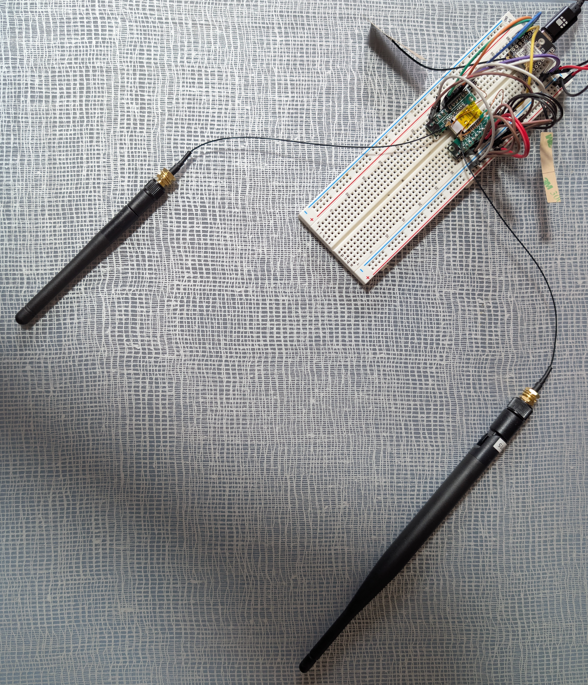

# LR1121 RX Bring-Up Test Bed

**Scope:** the physical hardware setup used for the Phase-1 Wio-LR1121 RX bring-up DOE (Runs 0–8) documented in [`../../LR1121-RX-INIT-AUDIT.md`](../../LR1121-RX-INIT-AUDIT.md) and the Seeed engineering correspondence in [`../../SEEED_EMAIL_DRAFT.md`](../../SEEED_EMAIL_DRAFT.md).

This document captures the bench so any reader (Seeed engineering, future-me, anyone reproducing the audit) can verify the test conditions and rule out test-rig artifacts when interpreting the firmware DOE results.

---

## 1. Hardware bill of materials

| Item | Part / model | Role |
|---|---|---|
| Host MCU | Seeed XIAO ESP32-S3 | Runs the bridge firmware; drives both radios over independent SPI buses |
| Reference radio (R1) | Seeed Wio-SX1262 (SKU 113991454, IPEX variant, FCC ID Z4T-WIO-SX1262) | Known-good sub-GHz baseline. RX/TX work correctly. Used as the sensitivity reference against which R2 is measured. |
| Device under test (R2) | Seeed Wio-LR1121 (SKU 113991415, IPEX variant, FCC ID Z4T-WIO-LR1121) | Subject of the RX failure investigation. Reports `Base FW version: 1.3`. |
| R2 carrier | 1.27mm → 2.54mm pitch adapter PCB (silkscreen "L2.54-1.27-2") | Adapts the Wio-LR1121's 1.27mm pad pitch to breadboard-friendly 2.54mm headers |
| Pin-pad workaround | 34 AWG enameled copper magnet wire with Kapton (polyimide) insulation | Two jumpers for **LR1121 module pins 12 and 14** — the carrier PCB did not have pads routed for these pins. Hand-soldered from the module pads directly to adjacent header pins. Signals carried are in the digital control cluster (RSTn / DIO8 / DIO9_INT region per the project schematic) — NOT RF. |
| RF feed (both radios) | IPEX (u.fl) connector on module → pre-fab IPEX-to-SMA pigtail coax → external SMA antenna | Symmetrical RF chain — same feed topology on both R1 and R2 |
| Antennas (2×) | Standard rubber-duck SMA antennas, ~17 cm, sub-GHz band (868/915 MHz class) | One per radio, separated ~30–40 cm on the bench surface (≈ 1λ at 906 MHz) |
| Power / programming | USB-CDC to XIAO ESP32-S3 (visible at top of breadboard) | Powers the XIAO directly. Both radio modules powered from the XIAO's 3V3 rail through the breadboard. Single ground plane. |
| Breadboard | Standard 830-tie solderless prototyping board | Hosts XIAO + both radio adapters + jumper wiring |
| Jumper wires | Standard 22 AWG silicone-insulated breadboard jumpers | SPI buses, DIO control lines, power and ground distribution |

## 2. RF topology

Both radios use **identical** RF chains end-to-end:

```
Wio module IPEX connector → IPEX→SMA pigtail (≈10 cm coax) → SMA male/female mate → rubber-duck antenna
```

The symmetry is intentional — it means any RX sensitivity asymmetry observed between R1 and R2 is attributable to the module/chip, not to the test rig.

**Antenna spacing:** ≈30–40 cm on the bench (visible in photo 1). At 906 MHz, λ ≈ 33 cm, so the spacing is roughly 1 wavelength — adequate for relative-sensitivity comparison between the two co-located radios receiving the same OTA traffic.

## 3. Host wiring summary

Two independent SPI buses, one per radio, with separate NSS / BUSY / RST / DIO1 (or DIO9 on LR1121) lines. Bus speeds at RadioLib defaults (~2 MHz). See [`../../src/main.cpp`](../../src/main.cpp) and the README for the authoritative pin map; the bench wiring matches that mapping verbatim.

**LR1121 pin-12/14 workaround.** The 1.27→2.54 mm pitch adapter PCB used for the Wio-LR1121 module did not have through-hole pads routed for module pins 12 and 14. Two jumpers were hand-soldered from the module pads directly across the top of the module body to adjacent adapter pins, using 34 AWG enameled magnet wire with Kapton insulation. This wire is visible in photos 2, 4, and 5 as the **orange loops over the yellow Kapton-taped module body**. The wire carries digital control signals (RSTn / DIO8 / DIO9_INT cluster per the project schematic) — it is **not** an RF feed or antenna element. The signals on these pins switch at edge rates well below any frequency where the wire's parasitic L/C would matter for signal integrity.

## 4. OTA reference signal sources

The bench is exposed to live Meshtastic LongFast (US 902–928 MHz, channel hash 0x08) traffic from neighborhood nodes during every test run. The reference radio R1 (SX1262) consistently demodulates packets from:

| Source | Long name | Typical RSSI at the bench |
|---|---|---|
| `!62D90E80` | Meshtastic 0e80 | -53 to -56 dBm |
| `!75D7AC1C` | B16B00B5 LoRa Bridge (self) | self-echo only; not used as external reference |
| `!148F4D57` | Mad Electron Warehouse Router | -53 to -60 dBm |
| `!67A923CA` | Meshpoint Mprns | -54 to -79 dBm |
| `!3D3A87A3` | Meshpoint Glasgow DE | -56 to -80 dBm |

This 30+ dB dynamic range of live OTA sources gives the DOE a useful sensitivity ladder to measure R2 against. R2 should be capturing the same packets at comparable RSSI; what it actually captures is documented per-run in the audit.

## 5. Test methodology and pass criterion

Both radios are tuned to identical Meshtastic LongFast parameters: **906.875 MHz, BW 250 kHz, SF 11, CR 4/5, sync word 0x2B, preamble length 16, CRC on**. They differ only in chip — same antenna grade, same coax pigtail, same breadboard ground.

**Pass criterion for any DOE run on R2:** at least one `[R2 RX] N bytes` log line where the decoded `src` field is NOT `0x75D7AC1C` (the bridge's own ID — i.e., not a near-field self-echo of R1's transmissions).

R1 acts as the in-band control. As long as R1 is capturing distant nodes during a test window (verified every run), the bench is known to be illuminated by real OTA signals at recoverable RSSI. If R2 then captures none of those same packets in the same window, the deficit is real and quantifiable.

## 6. Photos

### Photo 1 — Bench overview



Two external rubber-duck antennas, separated ~30–40 cm on the bench surface. Coax pigtails route from each antenna's SMA connector back to the breadboard in the upper right, which hosts the XIAO ESP32-S3, both Wio radio modules, and the host-side wiring.

### Photo 2 — Breadboard, both radios visible


Top: Wio-SX1262 with IPEX-to-SMA pigtail. Bottom: Wio-LR1121 mounted on the L2.54-1.27-2 adapter PCB. The orange loops are the 34 AWG Kapton-insulated digital jumpers for module pins 12 and 14 — not RF.

### Photo 3 — Wio-SX1262 (R1, reference) closeup


Clean IPEX-to-coax feed at the module's RF port. The pigtail routes off-board to the SMA-connected external antenna shown in photo 1.

### Photo 4 — Wio-LR1121 (R2, DUT) closeup


The yellow tape is polyimide (Kapton) protective film over the module body; the orange wires are the 34 AWG enameled-copper-with-Kapton-insulation jumpers carrying RSTn / DIO8 / DIO9_INT-cluster digital signals from module pins 12 and 14 to adapter header pads that the carrier PCB did not route. The IPEX RF connector and its coax pigtail to the external SMA antenna are present but obscured from this top-down angle.

### Photo 5 — Radios stacked view (alternate angle)


Alternate angle showing the SPI / DIO / power / ground jumper-wire routing and the relative positions of the two adapter PCBs on the breadboard.

## 7. What the test bed deliberately is and is NOT

**Is:**

- A development bench using stock manufacturer modules (Seeed Wio-SX1262 and Wio-LR1121) with their as-shipped integrated matching networks and antennas connected via the modules' designed-in IPEX RF ports
- A symmetrical A/B comparison rig — two radios, same antenna chain topology, same MCU, same firmware framework, same RF parameters
- Continuously exposed to real Meshtastic OTA traffic spanning 30 dB of received-signal dynamic range

**Is NOT:**

- A lab-grade RF setup with shielded enclosures, calibrated signal generators, or anechoic conditions
- A claim about absolute sensitivity numbers — all DOE conclusions are stated as relative deltas between R1 (SX1262 reference) and R2 (LR1121 DUT) on the same bench at the same time
- A custom RF design — the LR1121 module is used as Seeed shipped it, with no modifications to its matching network, RF traces, or shielding

The 34 AWG Kapton-jumper workaround for the carrier PCB's missing pads on module pins 12 and 14 is the only hand-soldered hardware modification. Those signals are digital host-control lines well below any frequency where the wire's added inductance affects behaviour, and the workaround has been verified electrically functional by:

- Successful chip detection and `GET_VERSION` response on every boot
- Successful `setRfSwitchTable()` install, `setRegulatorDCDC()`, `setRssiCalibration()`, `calibrateImage()`, `startReceive()`, `transmit()` — every command returns `state = 0`
- IRQ counter incrementing correctly on post-TX auto-fallback events
- TX path 100% functional (all bridged packets transmit and are received externally)
- One real RX event successfully demodulated when a strong-enough signal is present (-63 dBm self-echo of R1's NodeInfo in Run 7)

## 8. Cross-references

- DOE results and hypothesis refutation table: [`../../LR1121-RX-INIT-AUDIT.md`](../../LR1121-RX-INIT-AUDIT.md)
- Seeed engineering correspondence chain: [`../../SEEED_EMAIL_DRAFT.md`](../../SEEED_EMAIL_DRAFT.md)
- Drafted follow-up reply to David Du: [`../../SEEED_EMAIL_REPLY_2026-05-28.md`](../../SEEED_EMAIL_REPLY_2026-05-28.md)
- Skyworks SKY13373-460LF antenna-switch datasheet (Seeed-provided reference): [`../datasheets/310060742_SKYWORKS_SKY13373-460LF_Datasheet.pdf`](../datasheets/310060742_SKYWORKS_SKY13373-460LF_Datasheet.pdf)
- LR1121 driver source: [`../../src/WioLR1121.cpp`](../../src/WioLR1121.cpp)
- SX1262 driver source (reference comparison): [`../../src/WioSX1262.cpp`](../../src/WioSX1262.cpp)
